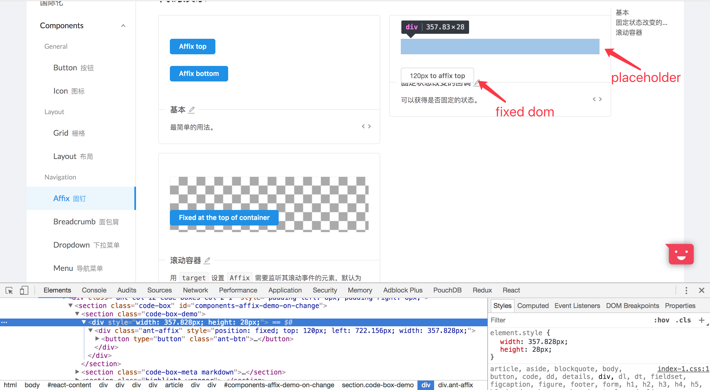

# Affix

这个组件是一个图钉组件，使用的fixed布局，让组件固定在窗口的某一个位置上，并且可以在到达指定位置的时候才去固定。

## AffixProps

还是老样子，看一个组件首先我们先来看看他可以传入什么参数

```js
  // Affix
  export interface AffixProps {
    /**
    * 距离窗口顶部达到指定偏移量后触发
    */
    offsetTop?: number;
    offset?: number;
    /** 距离窗口底部达到指定偏移量后触发 */
    offsetBottom?: number;
    style?: React.CSSProperties;
    /** 固定状态改变时触发的回调函数 */
    onChange?: (affixed?: boolean) => void;
    /** 设置 Affix 需要监听其滚动事件的元素，值为一个返回对应 DOM 元素的函数 */
    target?: () => Window | HTMLElement;
    // class样式命名空间，可以定义自己的样式命名
    prefixCls?: string;
  }
```

## Render()

看完传入参数之后，就到入口函数看看这里用到了什么参数

```js
  render() {
    // 构造当前组件的class样式
    const className = classNames({
      [this.props.prefixCls || 'ant-affix']: this.state.affixStyle,
    });
    // 这里和之前看的一样，忽略掉props中的在div标签上面不需要的一些属性
    // 但是貌似没有去掉offset，后面我还查了一下DIV上面能不能有offset
    // 但是没看见有offset，只看见offsetLeft, offsetHeight....
    const props = omit(this.props, ['prefixCls', 'offsetTop', 'offsetBottom', 'target', 'onChange']);
    const placeholderStyle = { ...this.state.placeholderStyle, ...this.props.style };
    return (
      // 注意咯 看这里placeholder的作用了 如图
      // 这里的placeholder的作用是当这个组件样式变为fixed的时候，
      // 会脱离文档流，然后导致原本的dom结构变化，宽高都会有所变化
      // 所以这是后放一个占位元素来顶住这一组件脱离文档流的时候的影响
      <div {...props} style={placeholderStyle}>
        <div className={className} ref="fixedNode" style={this.state.affixStyle}>
          {this.props.children}
        </div>
      </div>
    );
  }
```



接下来是重头戏，从render函数中我们应该看到了，控制当前组件的主要因素是两层div上的style这个属性，那么接下来我们就看看这两个style是如果构造的

## 从生命周期开始

这个小小的组件却有很多的代码，主要都是在处理状态的代码，乍一看下来很没有头绪，所以就想着从他们的生命周期开始深入了解，然后在生命周期中果然打开了新的世界，渐渐的理清楚了头绪，接下来我将带领大家一同来领略affix组件的风采：

```js
  // 这里就先将一些当前生命周期，组件做了什么吧
  // 首先是在Didmount的时候，这时候首先确定当前的一个固定节点是Window还是传入的DOM节点，
  // 然后利用setTargetEventListeners函数在这个固定节点上加上一些事件，
  // 然后设置一个当前组件的定时器，目的是希望在组件被销毁的时候能够将这些事件监听一并清除
  // 敲黑板，大家一定要注意了，自己写组件的时候如果存在什么事件监听的时候一定要在组件销毁
  // 的时候将其一并清除，不然会带来不必要的报错
  componentDidMount() {
    const target = this.props.target || getDefaultTarget;
    // Wait for parent component ref has its value
    this.timeout = setTimeout(() => {
      this.setTargetEventListeners(target);
    });
  }

  // 接下来在接收到传入参数的时候，检查一下当前的固定节点是否和之前的一样，
  // 不一样的就重新给节点绑定事件，并且更新当前组件的位置
  componentWillReceiveProps(nextProps) {
    if (this.props.target !== nextProps.target) {
      this.clearEventListeners();
      this.setTargetEventListeners(nextProps.target);

      // Mock Event object.
      this.updatePosition({});
    }
  }

  // 在组件被销毁的时候清除左右的绑定事件
  componentWillUnmount() {
    this.clearEventListeners();
    clearTimeout(this.timeout);
    (this.updatePosition as any).cancel();
  }
```

在这个三个生命周期中，我们看见了有这么几个函数，`setTargetEventListeners`,`clearEventListeners`,`updatePosition`,
我们就来看看他们都干了啥吧

## 三个函数

```js
  // 这里先放一些这些函数需要用到的一些东西
  function getTargetRect(target): ClientRect {
    return target !== window ?
      target.getBoundingClientRect() :
      { top: 0, left: 0, bottom: 0 };
  }

  function getOffset(element: HTMLElement, target) {
    // 这里的getBoundingClientRect()是一个很有用的函数，获取页面元素位置
    /**
    * document.body.getBoundingClientRect()
    * DOMRect {x: 0, y: -675, width: 1280, height: 8704, top: -675, …}
    *
    */
    const elemRect = element.getBoundingClientRect();
    const targetRect = getTargetRect(target);

    const scrollTop = getScroll(target, true);
    const scrollLeft = getScroll(target, false);

    const docElem = window.document.body;
    const clientTop = docElem.clientTop || 0;
    const clientLeft = docElem.clientLeft || 0;

    return {
      top: elemRect.top - targetRect.top +
        scrollTop - clientTop,
      left: elemRect.left - targetRect.left +
        scrollLeft - clientLeft,
      width: elemRect.width,
      height: elemRect.height,
    };
  }

  events = [
      'resize',
      'scroll',
      'touchstart',
      'touchmove',
      'touchend',
      'pageshow',
      'load',
    ];

  eventHandlers = {};

  setTargetEventListeners(getTarget) {
    // 得到当前固定节点
    const target = getTarget();
    if (!target) {
      return;
    }
    // 将之前的事件全部清除
    this.clearEventListeners();
    // 循环给当前固定节点绑定每一个事件
    this.events.forEach(eventName => {
      this.eventHandlers[eventName] = addEventListener(target, eventName, this.updatePosition);
    });
  }

  // 将当前组件中的每一个事件移除
  clearEventListeners() {
    this.events.forEach(eventName => {
      const handler = this.eventHandlers[eventName];
      if (handler && handler.remove) {
        handler.remove();
      }
    });
  }

  // 重点来了，划重点了，这段代码很长，但是总的来说是在计算组件和当前的固定节点之前的一个距离
  // 在最外层有一个有意思的东西 就是装饰器，等会我们可以单独酱酱这个装饰做了啥，
  // 如果对于装饰器不是很明白的同学可以去搜一下es6的装饰器语法糖和设计模式中的装饰器模式
  @throttleByAnimationFrameDecorator()
  updatePosition(e) {
    // 从props中获取到需要用到的参数
    let { offsetTop, offsetBottom, offset, target = getDefaultTarget } = this.props;
    const targetNode = target();

    // Backwards support
    // 为了做到版本兼容，这里获取一下偏移量的值
    offsetTop = offsetTop || offset;
    // 获取到当前固定节点的滚动的距离
    //getScroll函数的第一参数是获取的滚动事件的dom元素
    // 第二个参数是x轴还是y轴上的滚动， y轴上的为true
    const scrollTop = getScroll(targetNode, true);
    // 找到当前组件的Dom节点
    const affixNode = ReactDOM.findDOMNode(this) as HTMLElement;
    // 获取当前组件Dom节点和当前固定节点的一个相对位置
    const elemOffset = getOffset(affixNode, targetNode);
    // 将当前的节点的宽高设置暂存，等会需要赋值给placeholder的样式
    const elemSize = {
      width: this.refs.fixedNode.offsetWidth,
      height: this.refs.fixedNode.offsetHeight,
    };
    // 定义一个固定的模式，顶部还是底部
    const offsetMode = {
      top: false,
      bottom: false,
    };
    // Default to `offsetTop=0`.
    if (typeof offsetTop !== 'number' && typeof offsetBottom !== 'number') {
      offsetMode.top = true;
      offsetTop = 0;
    } else {
      offsetMode.top = typeof offsetTop === 'number';
      offsetMode.bottom = typeof offsetBottom === 'number';
    }
    // 获取到固定节点的位置信息
    const targetRect = getTargetRect(targetNode);
    // 算出固定节点的高度
    const targetInnerHeight =
      (targetNode as Window).innerHeight || (targetNode as HTMLElement).clientHeight;
    // 如果滚动条的距离大于组件位置高度减去传入参数的高度，并且偏移模式为向上的时候，这时候就是固定在顶部
    if (scrollTop > elemOffset.top - (offsetTop as number) && offsetMode.top) {
      // Fixed Top
      const width = elemOffset.width;
      this.setAffixStyle(e, {
        position: 'fixed',
        top: targetRect.top + (offsetTop as number),
        left: targetRect.left + elemOffset.left,
        width,
      });
      this.setPlaceholderStyle({
        width,
        height: elemSize.height,
      });
    } else if (
      // 如果滚动距离小于组件位置高度减去组件高度和传入参数的高度并且偏移模式为向下的时候，为固定在底部
      scrollTop < elemOffset.top + elemSize.height + (offsetBottom as number) - targetInnerHeight &&
        offsetMode.bottom
    ) {
      // Fixed Bottom
      const targetBottomOffet = targetNode === window ? 0 : (window.innerHeight - targetRect.bottom);
      const width = elemOffset.width;
      this.setAffixStyle(e, {
        position: 'fixed',
        bottom: targetBottomOffet + (offsetBottom as number),
        left: targetRect.left + elemOffset.left,
        width,
      });
      this.setPlaceholderStyle({
        width,
        height: elemOffset.height,
      });
    } else {
      const { affixStyle } = this.state;
      // 如果上面两者都是不的时候，但是如果窗口resize了，那就重新计算，然后赋值给组件
      if (e.type === 'resize' && affixStyle && affixStyle.position === 'fixed' && affixNode.offsetWidth) {
        this.setAffixStyle(e, { ...affixStyle, width: affixNode.offsetWidth });
      } else {
        // 如果以上情况都不是，那就样式不变
        this.setAffixStyle(e, null);
      }
      this.setPlaceholderStyle(null);
    }
  }
```

## 用到的其他辅助函数

在上面这一块代码中，有几个函数是外部辅助函数，但是却是比较有意思的，因为这些辅助函数需要写的很有复用性才有作用，所以正是我们值得学的地方
`getScroll()`, `throttleByAnimationFrameDecorator装饰器`，这两个东西是值得我们学习的，并且我们会一起学习装饰器模式

### getScroll()

这个函数主要是获取到传入的dom节点的滚动事件，其中需要讲解的是`window.document.documentElement`
它可以返回一个当前文档的一个根节点，详情可以查看[这里](http://www.cnblogs.com/ckmouse/archive/2012/01/30/2332070.html)
```js
  export default function getScroll(target, top): number {
    if (typeof window === 'undefined') {
      return 0;
    }
    // 为了兼容火狐浏览器，所以添加了这一句
    const prop = top ? 'pageYOffset' : 'pageXOffset';
    const method = top ? 'scrollTop' : 'scrollLeft';
    const isWindow = target === window;

    let ret = isWindow ? target[prop] : target[method];
    // ie6,7,8 standard mode
    if (isWindow && typeof ret !== 'number') {
      ret = window.document.documentElement[method];
    }

    return ret;
  }
```

### throttleByAnimationFrameDecorator装饰器

首先我们需要知道装饰器的语法糖，可以查看[这里](http://es6.ruanyifeng.com/#docs/decorator)

还有[typescript装饰器](https://www.tslang.cn/docs/handbook/decorators.html)

接下来我们还需要知道为什么使用装饰器，我这里就是简单的说一下，装饰器模式主要就是为了动态的增减某一个

类的功能而存在的，详情可以查看[这里](https://segmentfault.com/a/1190000005331132)

```js
// '../_util/getRequestAnimationFrame'
// 由于下面的装饰器还使用了这个文件里面的函数，所以一并给搬过来了
const availablePrefixs = ['moz', 'ms', 'webkit'];

function requestAnimationFramePolyfill() {
  // 这个函数用来生成一个定时器的或者监听器ID，如果当前定时器不是window
  // 上面的requestAnimationFrame那就自己生成一个，用于以后清除定时器使用
  let lastTime = 0;
  return function(callback) {
    const currTime = new Date().getTime();
    const timeToCall = Math.max(0, 16 - (currTime - lastTime));
    const id = window.setTimeout(function() { callback(currTime + timeToCall); }, timeToCall);
    lastTime = currTime + timeToCall;
    return id;
  };
}

export default function getRequestAnimationFrame() {
  // 这个函数返回一个定时器或者监听器ID
  if (typeof window === 'undefined') {
    return () => {};
  }
  if (window.requestAnimationFrame) {
    // https://github.com/vuejs/vue/issues/4465
    return window.requestAnimationFrame.bind(window);
  }
  // 做了浏览器兼容
  const prefix = availablePrefixs.filter(key => `${key}RequestAnimationFrame` in window)[0];

  return prefix
    ? window[`${prefix}RequestAnimationFrame`]
    : requestAnimationFramePolyfill();
}

export function cancelRequestAnimationFrame(id) {
  // 这个函数用来根据ID删除对应的定时器或者监听器
  if (typeof window === 'undefined') {
    return null;
  }
  if (window.cancelAnimationFrame) {
    return window.cancelAnimationFrame(id);
  }
  const prefix = availablePrefixs.filter(key =>
    `${key}CancelAnimationFrame` in window || `${key}CancelRequestAnimationFrame` in window,
  )[0];

  return prefix ?
    (window[`${prefix}CancelAnimationFrame`] || window[`${prefix}CancelRequestAnimationFrame`]).call(this, id)
    : clearTimeout(id);
}
```

```js
import getRequestAnimationFrame, { cancelRequestAnimationFrame } from '../_util/getRequestAnimationFrame';

// 获得一个定时器或者监听器
const reqAnimFrame = getRequestAnimationFrame();
// 这个函数收到一个函数 返回一个被放入监听其或者定时器额函数，
// 也就是说给这个传入的函数绑定了一个id，让他成为唯一的一个，
// 这样在消除他的时候也很方便
export default function throttleByAnimationFrame(fn) {
  let requestId;

  const later = args => () => {
    requestId = null;
    fn(...args);
  };

  const throttled = (...args) => {
    if (requestId == null) {
      // 获取定时器或者监听器ID，将监听事件传入
      requestId = reqAnimFrame(later(args));
    }
  };
  // 给这个函数添加上一个取消的函数
  (throttled as any).cancel = () => cancelRequestAnimationFrame(requestId);
  // 返回构造的新函数
  return throttled;
}

export function throttleByAnimationFrameDecorator() {
  return function(target, key, descriptor) {
    // 装饰器函数，传入typescript的方法构造器的三个参数
    // target: 当前函数（属性）属于的类
    // key: 当前函数（属性）名
    // dedescriptor： 当前属性的描述
    let fn = descriptor.value;
    let definingProperty = false;
    return {
      configurable: true,
      // 这里有一个疑惑 就是这个get（）函数是在什么时候被执行的呢？ 
      // 因为从外部看来 这个函数最多只执行到了上一层的return，这一层的
      // 没有被执行，那么一下代码都不会走，但是却能够调用新函数里面的属性。。。 好神奇，
      // 希望有大神能够在此解说一下 万分感激
      get() {
        if (definingProperty || this === target.prototype || this.hasOwnProperty(key)) {
          return fn;
        }

        let boundFn = throttleByAnimationFrame(fn.bind(this));
        definingProperty = true;
        // 重新将传入的函数定义成构造的新函数并且返回
        Object.defineProperty(this, key, {
          value: boundFn,
          configurable: true,
          writable: true,
        });
        definingProperty = false;
        return boundFn;
      },
    };
  };
}

```

## 完整代码

```js
  import React from 'react';
  import ReactDOM from 'react-dom';
  import PropTypes from 'prop-types';
  import addEventListener from 'rc-util/lib/Dom/addEventListener';
  import classNames from 'classnames';
  import shallowequal from 'shallowequal';
  import omit from 'omit.js';
  import getScroll from '../_util/getScroll';
  import { throttleByAnimationFrameDecorator } from '../_util/throttleByAnimationFrame';

  function getTargetRect(target): ClientRect {
    return target !== window ?
      target.getBoundingClientRect() :
      { top: 0, left: 0, bottom: 0 };
  }

  function getOffset(element: HTMLElement, target) {
    const elemRect = element.getBoundingClientRect();
    const targetRect = getTargetRect(target);

    const scrollTop = getScroll(target, true);
    const scrollLeft = getScroll(target, false);

    const docElem = window.document.body;
    const clientTop = docElem.clientTop || 0;
    const clientLeft = docElem.clientLeft || 0;

    return {
      top: elemRect.top - targetRect.top +
        scrollTop - clientTop,
      left: elemRect.left - targetRect.left +
        scrollLeft - clientLeft,
      width: elemRect.width,
      height: elemRect.height,
    };
  }

  function noop() {}

  function getDefaultTarget() {
    return typeof window !== 'undefined' ?
      window : null;
  }

  // Affix
  export interface AffixProps {
    /**
    * 距离窗口顶部达到指定偏移量后触发
    */
    offsetTop?: number;
    offset?: number;
    /** 距离窗口底部达到指定偏移量后触发 */
    offsetBottom?: number;
    style?: React.CSSProperties;
    /** 固定状态改变时触发的回调函数 */
    onChange?: (affixed?: boolean) => void;
    /** 设置 Affix 需要监听其滚动事件的元素，值为一个返回对应 DOM 元素的函数 */
    target?: () => Window | HTMLElement;
    prefixCls?: string;
  }

  export default class Affix extends React.Component<AffixProps, any> {
    static propTypes = {
      offsetTop: PropTypes.number,
      offsetBottom: PropTypes.number,
      target: PropTypes.func,
    };

    scrollEvent: any;
    resizeEvent: any;
    timeout: any;
    refs: {
      fixedNode: HTMLElement;
    };

    events = [
      'resize',
      'scroll',
      'touchstart',
      'touchmove',
      'touchend',
      'pageshow',
      'load',
    ];

    eventHandlers = {};

    constructor(props) {
      super(props);
      this.state = {
        affixStyle: null,
        placeholderStyle: null,
      };
    }

    setAffixStyle(e, affixStyle) {
      const { onChange = noop, target = getDefaultTarget } = this.props;
      const originalAffixStyle = this.state.affixStyle;
      const isWindow = target() === window;
      if (e.type === 'scroll' && originalAffixStyle && affixStyle && isWindow) {
        return;
      }
      if (shallowequal(affixStyle, originalAffixStyle)) {
        return;
      }
      this.setState({ affixStyle }, () => {
        const affixed = !!this.state.affixStyle;
        if ((affixStyle && !originalAffixStyle) ||
            (!affixStyle && originalAffixStyle)) {
          onChange(affixed);
        }
      });
    }

    setPlaceholderStyle(placeholderStyle) {
      const originalPlaceholderStyle = this.state.placeholderStyle;
      if (shallowequal(placeholderStyle, originalPlaceholderStyle)) {
        return;
      }
      this.setState({ placeholderStyle });
    }

    @throttleByAnimationFrameDecorator()
    updatePosition(e) {
      let { offsetTop, offsetBottom, offset, target = getDefaultTarget } = this.props;
      const targetNode = target();

      // Backwards support
      offsetTop = offsetTop || offset;
      const scrollTop = getScroll(targetNode, true);
      const affixNode = ReactDOM.findDOMNode(this) as HTMLElement;
      const elemOffset = getOffset(affixNode, targetNode);
      const elemSize = {
        width: this.refs.fixedNode.offsetWidth,
        height: this.refs.fixedNode.offsetHeight,
      };

      const offsetMode = {
        top: false,
        bottom: false,
      };
      // Default to `offsetTop=0`.
      if (typeof offsetTop !== 'number' && typeof offsetBottom !== 'number') {
        offsetMode.top = true;
        offsetTop = 0;
      } else {
        offsetMode.top = typeof offsetTop === 'number';
        offsetMode.bottom = typeof offsetBottom === 'number';
      }

      const targetRect = getTargetRect(targetNode);
      const targetInnerHeight =
        (targetNode as Window).innerHeight || (targetNode as HTMLElement).clientHeight;
      if (scrollTop > elemOffset.top - (offsetTop as number) && offsetMode.top) {
        // Fixed Top
        const width = elemOffset.width;
        this.setAffixStyle(e, {
          position: 'fixed',
          top: targetRect.top + (offsetTop as number),
          left: targetRect.left + elemOffset.left,
          width,
        });
        this.setPlaceholderStyle({
          width,
          height: elemSize.height,
        });
      } else if (
        scrollTop < elemOffset.top + elemSize.height + (offsetBottom as number) - targetInnerHeight &&
          offsetMode.bottom
      ) {
        // Fixed Bottom
        const targetBottomOffet = targetNode === window ? 0 : (window.innerHeight - targetRect.bottom);
        const width = elemOffset.width;
        this.setAffixStyle(e, {
          position: 'fixed',
          bottom: targetBottomOffet + (offsetBottom as number),
          left: targetRect.left + elemOffset.left,
          width,
        });
        this.setPlaceholderStyle({
          width,
          height: elemOffset.height,
        });
      } else {
        const { affixStyle } = this.state;
        if (e.type === 'resize' && affixStyle && affixStyle.position === 'fixed' && affixNode.offsetWidth) {
          this.setAffixStyle(e, { ...affixStyle, width: affixNode.offsetWidth });
        } else {
          this.setAffixStyle(e, null);
        }
        this.setPlaceholderStyle(null);
      }
    }

    componentDidMount() {
      const target = this.props.target || getDefaultTarget;
      // Wait for parent component ref has its value
      this.timeout = setTimeout(() => {
        this.setTargetEventListeners(target);
      });
    }

    componentWillReceiveProps(nextProps) {
      if (this.props.target !== nextProps.target) {
        this.clearEventListeners();
        this.setTargetEventListeners(nextProps.target);

        // Mock Event object.
        this.updatePosition({});
      }
    }

    componentWillUnmount() {
      this.clearEventListeners();
      clearTimeout(this.timeout);
      (this.updatePosition as any).cancel();
    }

    setTargetEventListeners(getTarget) {
      const target = getTarget();
      if (!target) {
        return;
      }
      this.clearEventListeners();

      this.events.forEach(eventName => {
        this.eventHandlers[eventName] = addEventListener(target, eventName, this.updatePosition);
      });
    }

    clearEventListeners() {
      this.events.forEach(eventName => {
        const handler = this.eventHandlers[eventName];
        if (handler && handler.remove) {
          handler.remove();
        }
      });
    }

    render() {
      const className = classNames({
        [this.props.prefixCls || 'ant-affix']: this.state.affixStyle,
      });

      const props = omit(this.props, ['prefixCls', 'offsetTop', 'offsetBottom', 'target', 'onChange']);
      const placeholderStyle = { ...this.state.placeholderStyle, ...this.props.style };
      return (
        <div {...props} style={placeholderStyle}>
          <div className={className} ref="fixedNode" style={this.state.affixStyle}>
            {this.props.children}
          </div>
        </div>
      );
    }
  }
```