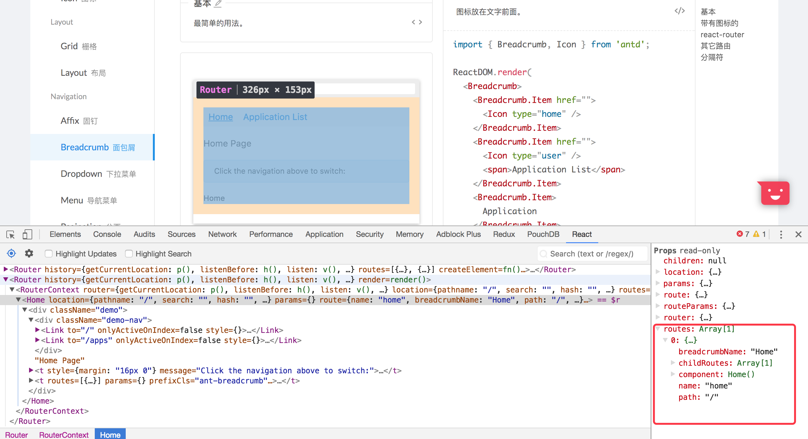

# Breadcrumb 面包屑

Antd的面包屑组件是一个能够结合路由进行跳转页面的组件，其中对于路由的支持是react-router@3以及react-router@4。

## BreadcrumbProps

一样的我们从组件传入参数开始入手，先弄清楚他接受那些参数，然后才知道这些参数在什么地方有什么作用

```js
  export interface BreadcrumbProps {
    prefixCls?: string; // 样式类的前缀
    routes?: Array<any>; // 路由的数组集合
    params?: Object; // 路由的参数对象集合
    separator?: React.ReactNode; // 每个item之间的分隔符
    itemRender?: (route: any, params: any, routes: Array<any>, paths: Array<string>) => React.ReactNode; // 自定义的渲染item的函数
    style?: React.CSSProperties; // 行内样式
    className?: string; // 自定义样式名
  }
```

## Render()

同样的一个组件的入口点就是他的render函数

```js
  render() {
    let crumbs;
    const {
      separator, prefixCls, style, className, routes, params = {},
      children, itemRender = defaultItemRender,
    } = this.props;
    if (routes && routes.length > 0) {
      // 如果有routes这个参数存在，就需要利用routes来构造item
      const paths: string[] = []; // 定义一个路径数组为空
      // 便利传入的routes，从antd的官网例子上面可以看出在react-router版本是4以下的时候
      // react-router会给传入组件传递一些参数回来，但是到了react-router4版本的时候、
      // 就需要自己构造这些参数了，这里主要使用了routes，params，children
      crumbs = routes.map((route) => {
        // 从官网上的例子中可以看到每一个route下面的对应回传参数如图
        route.path = route.path || '';
        // 将单个item路径按照‘/’分割成对应数组
        let path: string = route.path.replace(/^\//, '');
        Object.keys(params).forEach(key => {
          // 将单个item的path中的对应参数换成传入参数对应的值
          path = path.replace(`:${key}`, params[key]);
        });
        if (path) {
          // 最开始我没看懂这个地方为什么要不断的往paths这个数组之中插入路径，后来看了antd官网的实例
          // 知道了原来传入的routes数组的顺序是依次包含的关系，也就是第一个route是第一层路由，剩下的
          // 依次包含层级，但是这种传回方式仅限于react-router@3
          paths.push(path);
        }
        return (
          // 然后传入itemrender函数进行items的渲染，等会解读这个函数的时候就知道paths的作用了
          <BreadcrumbItem separator={separator} key={route.breadcrumbName || path}>
            {itemRender(route, params, routes, paths)}
          </BreadcrumbItem>
        );
      });
    } else if (children) {
      // 如果是存在孩子节点的时候就渲染孩子节点，使用的方法依旧是React.Children.map+React.cloneElement()
      // 我大胆的推测这段代码是为了适配react-router@4新增的
      crumbs = React.Children.map(children, (element: any, index) => {
        if (!element) {
          return element;
        }
        // 这里的waring函数是antd自身根据https://www.npmjs.com/package/warning
        // 封装了一个浏览器console框打印警告的工具函数
        warning(
          element.type && element.type.__ANT_BREADCRUMB_ITEM,
          'Breadcrumb only accepts Breadcrumb.Item as it\'s children',
        );
        return cloneElement(element, {
          separator,
          key: index,
        });
      });
    }
    return (
      <div className={classNames(className, prefixCls)} style={style}>
        {crumbs}
      </div>
    );
  }
```



## 使用react-router@3需要的函数

```js
  // 获取当前路由上的名字
  function getBreadcrumbName(route, params) {
    if (!route.breadcrumbName) {
      return null;
    }
    // 将所有参数使用 '|'分割形成字符串，用于下面的正则匹配
    const paramsKeys = Object.keys(params).join('|');
    // js的replace第一个参数可以是一个字符串或者是一个正则匹配，
    // 第二个参数可以是一个字符串或者是一个函数返回替换的字符串
    const name = route.breadcrumbName.replace(
      // 正则匹配参数，例如breadcrumbName='Application:id:name'
      // 这里的匹配正则串是：':id|name'
      // RegExp() 的第一个参数是正则匹配的表达式文本
      // 第二个参数是对于匹配的严格性的要求，g是代表全局匹配，而不是在匹配第一个后停止
      new RegExp(`:(${paramsKeys})`, 'g'),
      // 如果参数中这个参数有值就用这个值，没有就返回
      (replacement, key) => params[key] || replacement,
    );
    return name;
  }

  // 渲染item
  function defaultItemRender(route, params, routes, paths) {
    // 如果是最后一个item就不添加连接
    const isLastItem = routes.indexOf(route) === routes.length - 1;
    const name = getBreadcrumbName(route, params);
    return isLastItem
      ? <span>{name}</span>
      : <a href={`#/${paths.join('/')}`}>{name}</a>;
  }
```

# BreadcrumbItem

单独的一个用来编写Breadcrumb的items的组件，我觉得是为了能够在react-router@4上面使用，

因为现在react-router@4是需要自己编写路由层级，所以这样的方式更加灵活

## BreadcrumbItemProps

虽然是子组件，但是也还是需要从他的参数开始了解

```js
  export interface BreadcrumbItemProps {
    prefixCls?: string; // 样式类的命名空间前缀
    separator?: React.ReactNode; // item的分隔符
    href?: string; // 连接
  }
```

## Render()

render函数比较简单

```js
  render() {
    const { prefixCls, separator, children, ...restProps } = this.props;
    let link;
    // 如果有href这个props，就使用a标签
    if ('href' in this.props) {
      link = <a className={`${prefixCls}-link`} {...restProps}>{children}</a>;
    } else {
      link = <span className={`${prefixCls}-link`} {...restProps}>{children}</span>;
    }
    if (children) {
      return (
        <span>
          {link}
          <span className={`${prefixCls}-separator`}>{separator}</span>
        </span>
      );
    }
    return null;
  }
```

## 组件的身份证明

这个组件中有一个东西代表了他的身份

```js
export default class BreadcrumbItem extends React.Component<BreadcrumbItemProps, any> {
  static __ANT_BREADCRUMB_ITEM = true; // 身份证明，代表他是一个antbreadcrumb的子元素
```

接下来我们就看看他是怎么使用的吧，在上面的Breadcrumb的render代码中有一段代码

```js
  crumbs = React.Children.map(children, (element: any, index) => {
    if (!element) {
      return element;
    }
    warning(
    // 这里的element.type，想必大家一定在想是什么东西，那么我将为大家揭晓
    // 在react的官网上面有做React.Children.map的解释，其中就有element.type是什么
    // React.cloneElement() is almost equivalent to:
    // <element.type {...element.props} {...props}>{children}</element.type>
    // the type argument can be either a tag name string (such as 'div' or 'span'), 
    // or a React component type (a class or a function).
    // 相信大家看了这段话，就知道这个身份证明怎么使用了吧，以后大家也可以这样标识自己
    // 制作的组件，是不是感觉很酷
      element.type && element.type.__ANT_BREADCRUMB_ITEM,
      'Breadcrumb only accepts Breadcrumb.Item as it\'s children',
    );
    return cloneElement(element, {
      separator,
      key: index,
    });
  });
```