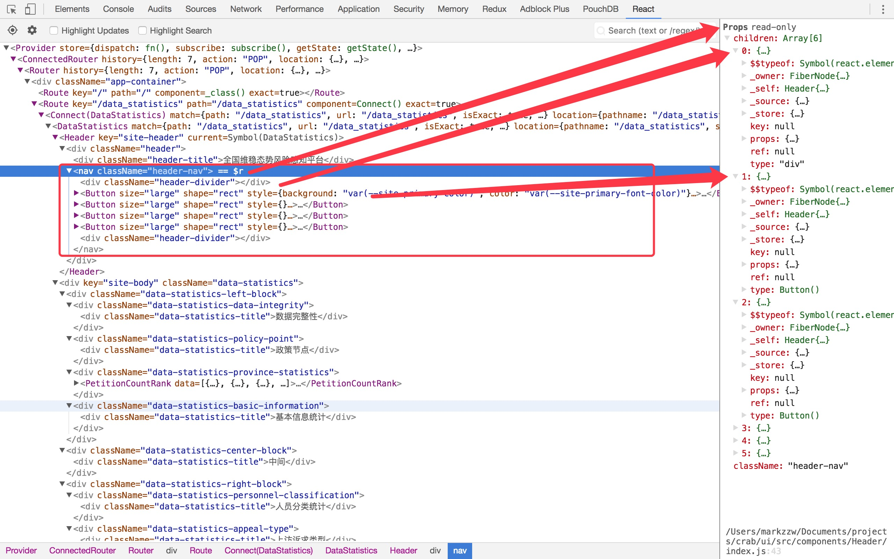

# Button

`Button`包括了两个组件，`Button`与`ButtonGroup`。

## ButtonProps

看一个组件首先看的是他的传参也就是`props`，所以我们这里先看`Button`组件的`ButtonProps`

```js
  export type ButtonType = 'primary' | 'ghost' | 'dashed' | 'danger';
  export type ButtonShape = 'circle' | 'circle-outline';
  export type ButtonSize = 'small' | 'large';

  // typescript语法，这里表示的是一些参数，参数后面跟上 ? 是可选参数的意思，不跟就是必须参数
  // 参数后面所跟的就是参数的类型，类型可以是自定义的类型，就如‘ButtonType’，‘ButtonShape’，‘ButtonSize’
  // 也可以是函数或者类，如React.FormEventHandler<any> 
  // 详情请看这里 https://www.tslang.cn/docs/handbook/interfaces.html
  export interface ButtonProps {
    type?: ButtonType;
    htmlType?: string;
    icon?: string;
    shape?: ButtonShape;
    size?: ButtonSize;
    onClick?: React.FormEventHandler<any>;
    onMouseUp?: React.FormEventHandler<any>;
    onMouseDown?: React.FormEventHandler<any>;
    loading?: boolean | { delay?: number };
    disabled?: boolean;
    style?: React.CSSProperties;
    prefixCls?: string;
    className?: string;
    ghost?: boolean;
  }
```

## Render()

看完其参数有哪些之后我们就直接跳过组件内部的其他的东西，直接看他的渲染函数，毕竟这里是执行的入口
这里顺带提一下这句代码

```js 
// 这里的意思是将传入两个参数，React.Component的参数第一个是Props，第二个是state，
// 然后利用typescript的类型检查，Props类型需要时上面定义的ButtonProps中的可选参数中的变量名
// state这里传入任意都行
export default class Button extends React.Component<ButtonProps, any>
```

```js
// 接下来是render()
  render() {
    // 将参数从props解构出来
    const {
      type, shape, size = '', className, htmlType, children, icon, prefixCls, ghost, ...others,
    } = this.props;
    // 将loading和clicked两个状态从state解构
    const { loading, clicked } = this.state;

    // large => lg
    // small => sm
    let sizeCls = '';
    switch (size) {
      case 'large':
        sizeCls = 'lg';
        break;
      case 'small':
        sizeCls = 'sm';
      default:
        break;
    }
    // 组建样式
    const classes = classNames(prefixCls, className, {
      [`${prefixCls}-${type}`]: type,
      [`${prefixCls}-${shape}`]: shape,
      [`${prefixCls}-${sizeCls}`]: sizeCls,
      [`${prefixCls}-icon-only`]: !children && icon,
      [`${prefixCls}-loading`]: loading,
      [`${prefixCls}-clicked`]: clicked,
      [`${prefixCls}-background-ghost`]: ghost,
    });

    // 是否需要加载
    const iconType = loading ? 'loading' : icon;
    // 是否需要添加Icon，不过官方给的是如果需要用到icon的话最好自己写在里面

    const iconNode = iconType ? <Icon type={iconType} /> : null; 

    const needInserted = React.Children.count(children) === 1 && (!iconType || iconType === 'loading');

    // 重点在这里，敲黑板了
    // 这里引用了React.Children.map这个函数来对这个包裹在这个Button组件中的内容渲染出来
    // 其中insertSpace()这个函数也有意思，这个函数主要是为了在当组建中间写的是中文汉字的时
    // 候给其汉字之间添加一个空格作为分隔,这里有的同学会问为什么不用css里面的letter-space
    // 属性，这个我也不是很清楚。。。不过他不用的话可能是是不想在英文字母中间添加空格吧

    const kids = React.Children.map(children, child => insertSpace(child, needInserted));

    return (
      <button
        // 还是和Icon组件一样，将用不到的props去除掉
        {...omit(others, ['loading', 'clicked'])}
        type={htmlType || 'button'}
        className={classes}
        onClick={this.handleClick}
      >
        {iconNode}{kids}
      </button>
    );
  }

```

## InsertSpace()

上面讲到了这个函数，这里就来仔细看看是干嘛的吧

```js
  const rxTwoCNChar = /^[\u4e00-\u9fa5]{2}$/;
  // 这里的bind有必要好好的理解一下
  const isTwoCNChar = rxTwoCNChar.test.bind(rxTwoCNChar);
  function isString(str: any) {
    return typeof str === 'string';
  }

  // Insert one space between two chinese characters automatically.
  function insertSpace(child: React.ReactChild, needInserted: boolean) {
    // Check the child if is undefined or null.
    if (child == null) {
      return;
    }
    const SPACE = needInserted ? ' ' : '';
    // strictNullChecks oops.
    // 这个判断的意思是当这个child不是字符串也不是数字并且child.type为字符串并且child的children是汉字的情况下
    // 给其加上空格，上面说的是代码直译，那么代码意译下来就是这样的一个情况
    // 这种情况（所以这里他才会有一个英文注释，说的是不是严格意义的检查，啊哈哈，尴尬的实现方法）
    // <Button>
    //   <div>你好啊</div>
    // </Button>
    // 这里说明一下，child.type以及child.props.children是react在渲染的时候会给虚拟dom添加的一些属性，如图
    if (typeof child !== 'string' && typeof child !== 'number' &&
      isString(child.type) && isTwoCNChar(child.props.children)) {
      return React.cloneElement(child, {},
        child.props.children.split('').join(SPACE));
    }
    // 这种情况就很明了了 就是Button组件中写的汉字
    if (typeof child === 'string') {
      if (isTwoCNChar(child)) {
        child = child.split('').join(SPACE);
      }
      return <span>{child}</span>;
    }
    return child;
  }
```


## 完整源代码

剩下的都是一些简单的东西，也没有什么可以讲的了

```js
  import React from 'react';
  import PropTypes from 'prop-types';
  import classNames from 'classnames';
  import omit from 'omit.js';
  import Icon from '../icon';
  import Group from './button-group';

  const rxTwoCNChar = /^[\u4e00-\u9fa5]{2}$/;
  const isTwoCNChar = rxTwoCNChar.test.bind(rxTwoCNChar);
  function isString(str: any) {
    return typeof str === 'string';
  }

  // Insert one space between two chinese characters automatically.
  function insertSpace(child: React.ReactChild, needInserted: boolean) {
    // Check the child if is undefined or null.
    if (child == null) {
      return;
    }
    const SPACE = needInserted ? ' ' : '';
    // strictNullChecks oops.
    if (typeof child !== 'string' && typeof child !== 'number' &&
      isString(child.type) && isTwoCNChar(child.props.children)) {
      return React.cloneElement(child, {},
        child.props.children.split('').join(SPACE));
    }
    if (typeof child === 'string') {
      if (isTwoCNChar(child)) {
        child = child.split('').join(SPACE);
      }
      return <span>{child}</span>;
    }
    return child;
  }

  export type ButtonType = 'primary' | 'ghost' | 'dashed' | 'danger';
  export type ButtonShape = 'circle' | 'circle-outline';
  export type ButtonSize = 'small' | 'large';

  export interface ButtonProps {
    type?: ButtonType;
    htmlType?: string;
    icon?: string;
    shape?: ButtonShape;
    size?: ButtonSize;
    onClick?: React.FormEventHandler<any>;
    onMouseUp?: React.FormEventHandler<any>;
    onMouseDown?: React.FormEventHandler<any>;
    loading?: boolean | { delay?: number };
    disabled?: boolean;
    style?: React.CSSProperties;
    prefixCls?: string;
    className?: string;
    ghost?: boolean;
  }

  export default class Button extends React.Component<ButtonProps, any> {
    // 这里这样子写只是为了方便这样子写Button.Group来引用ButtonGroup这个组件，下一节将会讲解这个组件
    static Group: typeof Group;
    static __ANT_BUTTON = true;

    static defaultProps = {
      prefixCls: 'ant-btn',
      loading: false,
      clicked: false,
      ghost: false,
    };

    static propTypes = {
      type: PropTypes.string,
      shape: PropTypes.oneOf(['circle', 'circle-outline']),
      size: PropTypes.oneOf(['large', 'default', 'small']),
      htmlType: PropTypes.oneOf(['submit', 'button', 'reset']),
      onClick: PropTypes.func,
      loading: PropTypes.oneOfType([PropTypes.bool, PropTypes.object]),
      className: PropTypes.string,
      icon: PropTypes.string,
    };

    timeout: number;
    delayTimeout: number;

    constructor(props: ButtonProps) {
      super(props);
      this.state = {
        loading: props.loading,
      };
    }

    componentWillReceiveProps(nextProps: ButtonProps) {
      const currentLoading = this.props.loading;
      const loading = nextProps.loading;

      if (currentLoading) {
        clearTimeout(this.delayTimeout);
      }

      if (typeof loading !== 'boolean' && loading && loading.delay) {
        this.delayTimeout = setTimeout(() => this.setState({ loading }), loading.delay);
      } else {
        this.setState({ loading });
      }
    }

    // 在组件销毁的时候一定要记得将定时器也一同销毁
    componentWillUnmount() {
      if (this.timeout) {
        clearTimeout(this.timeout);
      }
      if (this.delayTimeout) {
        clearTimeout(this.delayTimeout);
      }
    }

    handleClick = (e: React.MouseEvent<HTMLButtonElement>) => {
      // Add click effect
      this.setState({ clicked: true });
      clearTimeout(this.timeout);
      this.timeout = setTimeout(() => this.setState({ clicked: false }), 500);

      const onClick = this.props.onClick;
      if (onClick) {
        onClick(e);
      }
    }

    render() {
      const {
        type, shape, size = '', className, htmlType, children, icon, prefixCls, ghost, ...others,
      } = this.props;

      const { loading, clicked } = this.state;

      // large => lg
      // small => sm
      let sizeCls = '';
      switch (size) {
        case 'large':
          sizeCls = 'lg';
          break;
        case 'small':
          sizeCls = 'sm';
        default:
          break;
      }

      const classes = classNames(prefixCls, className, {
        [`${prefixCls}-${type}`]: type,
        [`${prefixCls}-${shape}`]: shape,
        [`${prefixCls}-${sizeCls}`]: sizeCls,
        [`${prefixCls}-icon-only`]: !children && icon,
        [`${prefixCls}-loading`]: loading,
        [`${prefixCls}-clicked`]: clicked,
        [`${prefixCls}-background-ghost`]: ghost,
      });

      const iconType = loading ? 'loading' : icon;
      const iconNode = iconType ? <Icon type={iconType} /> : null;
      const needInserted = React.Children.count(children) === 1 && (!iconType || iconType === 'loading');
      const kids = React.Children.map(children, child => insertSpace(child, needInserted));

      return (
        <button
          {...omit(others, ['loading', 'clicked'])}
          type={htmlType || 'button'}
          className={classes}
          onClick={this.handleClick}
        >
          {iconNode}{kids}
        </button>
      );
    }
  }
```