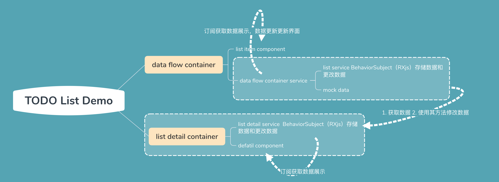
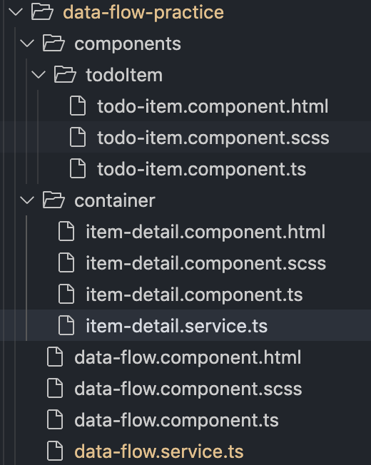
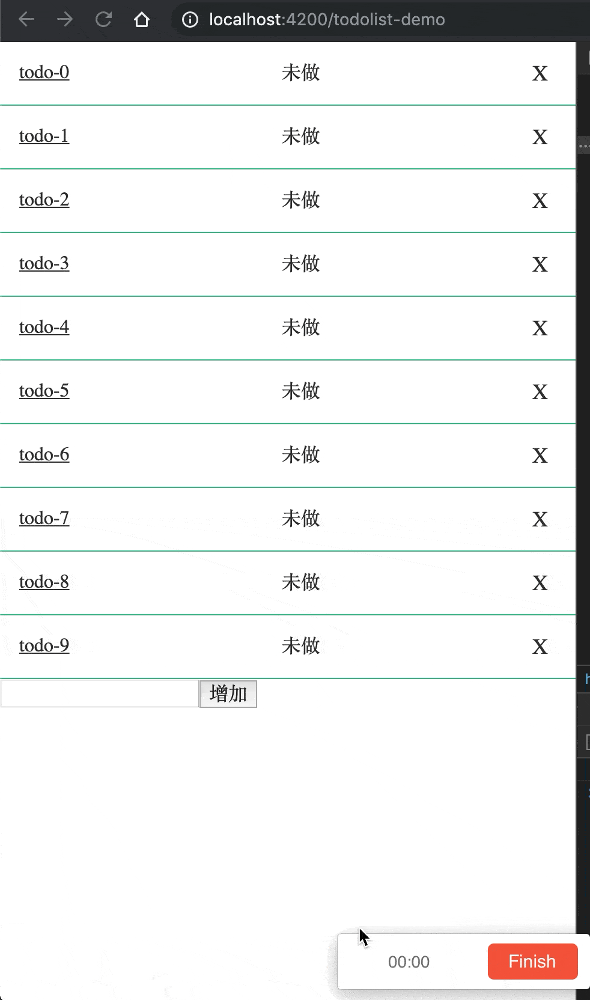
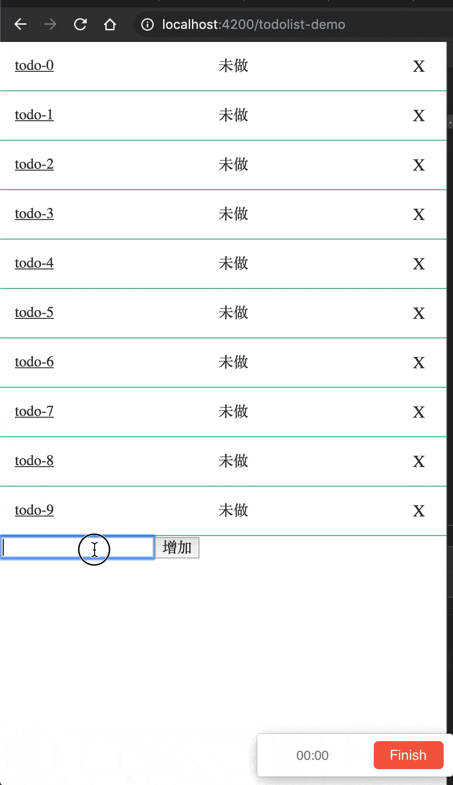

> github: [地址](https://github.com/zhangzewei/read-antd-code)
> gitbook: [地址](https://zhangzewei.gitbooks.io/read-antd-code/content/)

# Angular + rxJS 的数据流向实例与讲解

> 作者：markzzw 时间：2019-12-24 &nbsp;&nbsp; 本文代码： [github](https://github.com/zhangzewei/my_components/blob/master/angularComponents/src/app/containers/data-flow-practice/data-flow.service.ts)

## 简介

通过 `todo list` 例子简单展示一个 `Angular` 中的数据流管理方案；如图：



项目结构如图：




我们的目的很简单：

1. 生成若干 `TODO item`;
2. 展示这些 `TODO item`;
3. 修改 `TODO item`，使其数据能够进行同步，而不需要进行数据重新请求；

## data-flow.componnet.ts & data-flow.service.ts

从最外层组件开始，我们会有一个 `container` 作为入口，并且会配备一个 `service` 作为其数据管理层

+ data-flow.service.ts

```ts
...
@Injectable({
  providedIn: 'root'
})
export class DataFlowService {
  dataFlowSubject: BehaviorSubject<DataFlowData>;
  dataFolwData: DataFlowData;
  constructor() {
    if (!this.dataFolwData) {
      this.dataFolwData = this.initDataFlowData();
      this.mockList(10);
    }
    this.dataFlowSubject = new BehaviorSubject<DataFlowData>(this.dataFolwData);
  }

  getDataFlowSubject = () => {
    this.updateData();
    return this.dataFlowSubject;
  }
  
  initDataFlowData = () => ({
    list: []
  });

  updateData = () => {
    this.dataFlowSubject.next(this.dataFolwData);
  }

  mockList = (num: number) => {
    const list: TodoList[] = [];
    if (num > 0) {
      for (let i = 0; i < num; i++) {
        list.push({
          id: cuid(),
          text: `todo-${i}`,
          status: TodoStatus.TODO
        });
      }
    }
    this.dataFolwData.list = list;
  }
  ...
}
```

+ data-flow.componnet.ts
```ts
@Component({
  selector: 'data-flow',
  templateUrl: './data-flow.component.html',
  styleUrls: ['./data-flow.component.scss']
})
export class DataFlowComponent implements OnInit {
  dataFlowSubject: BehaviorSubject<DataFlowData>;
  todoList: TodoList[];
  constructor(
    private dataFlowService: DataFlowService
  ) {
    this.dataFlowSubject = this.dataFlowService.getDataFlowSubject();
  }

  ngOnInit() {
    this.dataFlowSubject.subscribe((data: DataFlowData) => {
      this.todoList = data.list;
    });
  }
}
```

我们将 `service` 注册在 `root`，使其成为一个当 `app` 生成就存在的单例，并且初始化数据，mock 假数据，使用 `rxJS` 生成一个 `BehaviorSubject` 的订阅器，然后将初始化的数据，放入生成的订阅器作为初始数据；

再在构造 `component` 的时候获取到 `service` 中的订阅器，在组件初始化的钩子函数中订阅上我们的更新方法，这样 `component` 与 `service` 就建立了联系；

这里不难看出，我们在 `service` 中存储了一个持久化的数据，也就是我们的总的一个数据，我们后面就只会修改这个数据，然后再进行重绘进行组件的更新，虽然这里的数据是 mock 的假数据，但是在真实项目中，我们也可以将取回来的数据存在这里，然后对其做 `增 删 改 查` 的操作，这样子可以避免一些不必要的网络消耗，但是也会存在一定的弊端，就是数据量不能建议太大；

所以接下来我们给其增加上 `add` 函数来增加 `TODO`,

+ data-flow.service.ts
```ts
add = (item: TodoList) => {
  this.dataFolwData.list.push(item);
  this.updateData();
}
```

+ data-flow.componnet.ts
```ts
addTodo = () => {
  if (this.addText) {
    this.dataFlowService.add({
      id: cuid(),
      text: this.addText,
      status: TodoStatus.TODO
    });
    this.addText = '';
  }
}
```

由于我们在 `service` 的 `add` 中使用了 `updateData` 触发订阅器的 `next`，将最新的数据传出，`component` 就会接收到数据就会根据数据进行重绘；



同理，我们也可以写上删除的方法，也是调用 `updateData` 触发订阅器更新数据，

+ todo-item.component.ts
```ts
@Component({
  selector: 'todo-item',
  templateUrl: './todo-item.component.html',
  styleUrls: ['./todo-item.component.scss']
})
export class TodoItemComponent implements OnInit {
  @Input() todoItem: TodoList;
  constructor(
    private dtService: DataFlowService
  ) {
  }
  ngOnInit() {}

  deleteItem = () => {
    this.dtService.deleteItem(this.todoId);
  }
}
```

+ data-flow.service.ts
```ts
deleteItem = (id: string) => {
  this.dataFolwData.list = this.dataFolwData.list.filter((item: TodoList) => item.id !== id);
  this.updateData();
}
```



## detail.component 和 data-flow.service 的关系

为了更明显的验证 `data-flow service` 的数据是持久化的，并且能够重复使用的，新建一个组件 `detail container` 展示详情数据以及可以更改数据，然后将数据同步到 `data-flow service` ，再次回到 `data-flow container` ，查看我们的修改是否生效；

+ detail.component
```ts
@Component({
  selector: 'item-detail',
  templateUrl: './item-detail.component.html',
  styleUrls: ['./item-detail.component.scss']
})
export class TodoDetailComponent implements OnInit {
  detailSubject$: DetailServiceSubject;
  detailId: string;
  detail: TodoList;
  isLoading: boolean;
  todoStatus = TodoStatus;
  constructor(
    private route: ActivatedRoute,
    private router: Router,
    private detailService: DetailService,
    private dataFlowService: DataFlowService
  ) {
    this.detailSubject$ = this.detailService.getDetailSubject();
    this.detailSubject$.subscribe(this.updateDetail);
  }

  ngOnInit() {
    const newId = this.route.snapshot.paramMap.get('id');
    this.isLoading = true;
    if (newId === this.detailId) {
      this.isLoading = false;
    } else {
      this.detailId = newId;
      this.detailService.getDetail(this.detailId);
    }
  }

  get status() {
    return statusMapping[this.detail.status] || '无状态';
  }

  updateDetail = (data: TodoList) => { 
    this.detail = data;
    this.isLoading = false;
  }

  changeValue = (event: Event) => {
    const value = (event.target as HTMLInputElement).value;
    this.detail.text = value;
  }

  delete = () => {
    this.dataFlowService.delete(this.detailId);
    this.router.navigate(['/todolist-demo']);
  }

  change = () => {
    this.dataFlowService.updateItem(this.detail);
    this.router.navigate(['/todolist-demo']);
  }

  changeStatus = (event: Event) => {
    const value = (event.target as HTMLInputElement).value;
    this.detail.status = value as TodoStatus;
  }
}
```

+ detail.service
```ts
@Injectable({
  providedIn: 'root'
})
export class DetailService {
  detailSubject: DetailServiceSubject;
  detailData: TodoList;

  constructor(
    private dataFlowService: DataFlowService
  ) {
    this.detailData = null;
    this.detailSubject = new BehaviorSubject<TodoList>(this.detailData);
  }

  getDetailSubject = () => {
    this.updateData();
    return this.detailSubject;
  };

  getDetail = (id: string) => {
    if (get(this.detailData, 'id', null) === id) {
      this.updateData();
    } else {
      this.dataFlowService.asyncGetItemById(id, (data: TodoList) => {
        this.detailData = data;
        this.updateData();
      })
    }
  };

  updateData = () => {
    this.detailSubject.next(this.detailData);
  }
}
```

+ data-flow.service.ts
```ts
  updateItem = (item: TodoList) => {
    this.dataFolwData.list = this.dataFolwData.list.map(todo => {
      if (todo.id === item.id) return item;
      return todo;
    })
  }

  asyncGetItemById = (id: string, callback) => {
    const detail = this.dataFolwData.list.filter(item => item.id === id)[0];
    setTimeout(function() { callback(detail) }, 1000);
  };

  changeStatus = (item: TodoList) => {
    this.dataFolwData.list = this.dataFolwData.list.map((d: TodoList) => {
      if (d.id === item.id) {
        return item;
      }
      return d;
    });
    this.updateData();
  }
```

同样的，container 层面的 component，都将数据放在 service 中进行处理和更新，`detail component` 也使用这样的方式，进行数据的订阅和更新；

在 `detail component` 中，声明了 `dataFlowService`，是为了将数据的更改同步到列表页面的数据中去，这样子在回到刚才那个页面的时候，数据才会得到更改，当然这里只是同步必要的数据，比如 `状态 文字 删除`，如果有其他的数据仅仅只是 detail 独有的，但是不是 list 拥有的数据，就不需要同步；

效果如图所示:


在进入 `detail` 页面时，会有一个 loading 的提示，这是制作的一个假的异步获取的代码，在 `detail component` 中有一个判断，如果当前的 id 与 前一个 id 不相同则进行请求数据，相同就直接取消掉 loading 效果，这是因为，在构造这个组件的时候，用的是 `BehaviorSubject`，这个订阅器在订阅的时候会将最后一次数据传过来作为数据使用，所以当 id 相同时在 `detail component` 中，不再需要去进行获取数据的操作，这也就减少了一些网络请求，增加了用户体验；

## 总结

通过service进行数据管理，在component中订阅数据更新方法，获取到（新）数据进行页面更新，进而减少对网络的请求，提升用户体验，也能够有一个较为清晰的数据流向，能够容易的理解数据流向就能够容易理解业务上的流程；

## 参考资料

1. [rxjs-BehaviorSubject](https://rxjs-dev.firebaseapp.com/api/index/class/BehaviorSubject)
2. [angular-service](https://www.angular.cn/start/data)

