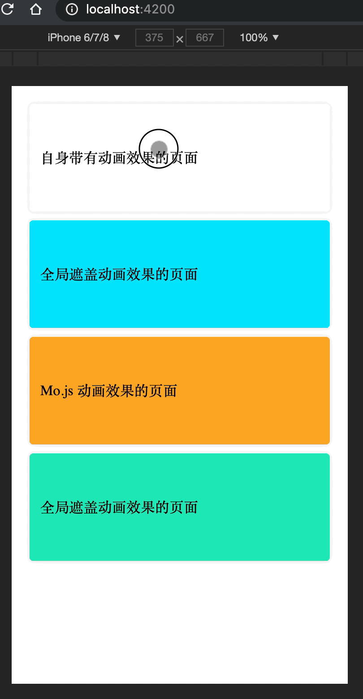
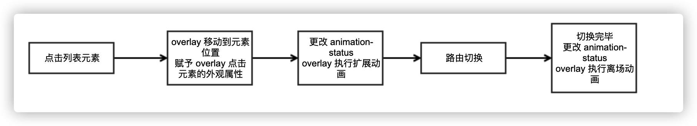
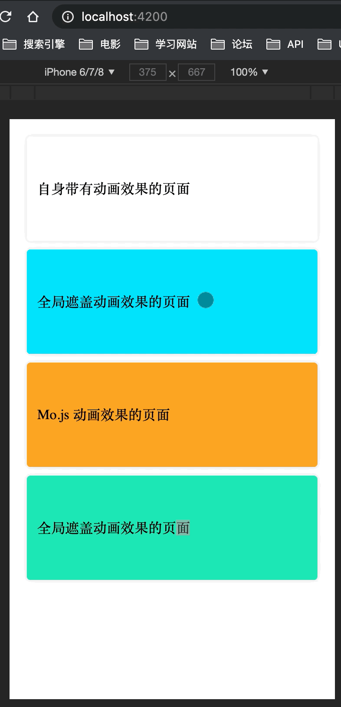
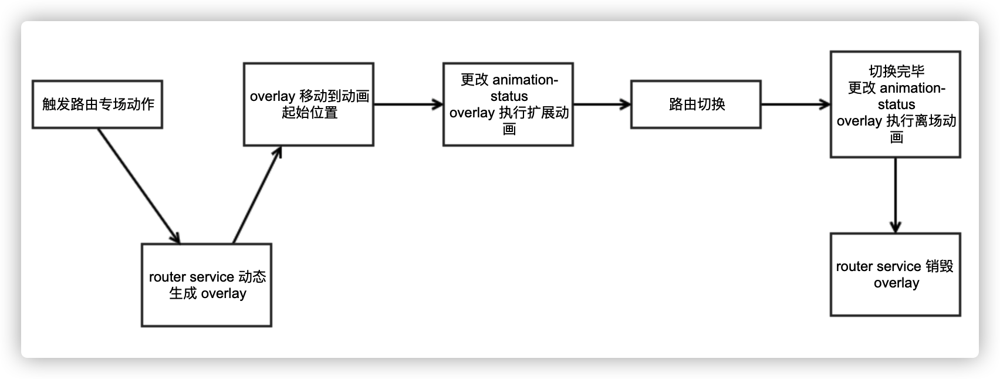
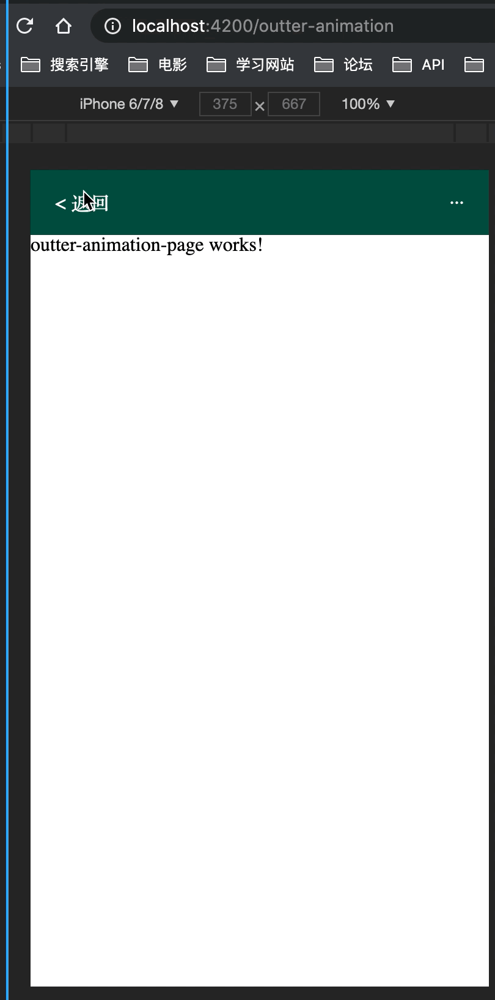

# angular 路由动画方案
> [github](https://github.com/zhangzewei/angular-animation-strategy)

动画一直是前端项目中交互的重要一环，在很多时候，动画效果可以给用户的体验带来很大的提升，甚至可以增加用户留存率，一般滴，动画效果会分为以下几类：

## 动效简介

#### 一、状态更改 (吸引注意，引导用户)
1. 0 <-> 1 状态互换，各种 checkbox 状态
2. 多个状态切换，radio 按钮，Input 框的状态

> 可以使用 css 的伪类和 css animation 完成，[参考](https://juejin.cn/post/6939843361620787230)。


#### 二、Crash / Empty 页面（安抚情绪）
1. 有趣的动图

> 可以使用设计师做好的动图或者使用一些第三方的动画库制作一些有趣的动画放在页面上。


#### 三、Loading 状态（缓解焦虑）
1. spin（旋转）
2. 骨架屏
3. process loading （进度条）
4. 页面切换过场动画


> 旋转、骨架屏、进度条这三个都是能够在当前页面加载前放在页面作为占位符使用，更多的是展示当前页面的状态，没有强调当前页面与上一个页面的关系，但是第四点过场动画则是强调的页面之间的关系，是一种比较特殊的，也是比较优雅的方式，也是本文所讲的重点。

> 以上图片源自于 [交互体验之动效深耕（上）](https://mp.weixin.qq.com/s/avrCA9GfdBM5jT8wuktpSg)

## 路由间的过场动画
1. ### angular 自带的过场方案

在 angular 的官方文档中[有一章](https://angular.io/guide/route-animations)专门是说了关于路由转换之间的过场动画方案，也有对应的  [demo](https://stackblitz.com/angular/baodgymjdap?file=src%2Fapp%2Fapp-routing.module.ts)。

简单的来说就是在路由层绑定 animation-trigger，事先准备好路由切换的动画，然后在路由切换时，根据路由所带参数，变换动画状态，使得路由组件进行动画过场。


2. ### 使用蒙板作为过场动画的方案
第一种方案是官方的，也是最简单的实现方案，但是有一个过场动画更加优雅，也更能够展示页面层级关系


这样的 demo 展示的是当我点击了某一个元素之后，页面又这个元素扩散开来，最终跳转到下一个页面去，这样的扩散效果，比之前的页面左右切换要更加能够展示出页面层级关系，那么接下来可以思考一下，怎么样才能够达到这样的效果。

首先第一想到的是点击某个元素，然后当前元素撑开展示内容，但是如果这个 app 的内容较多，并且页面层级够深，那么我们将会打开很多类似的元素，最终导致页面元素过多，影响到页面流畅度，所以这个方案是行不通的。

那如果使用 angular 提供的方案是否可行呢？我没想到一个方案，因为当我切换路由的时候，如果给路由组件动态生成的动效使得路由变成点击元素那样大小，那整个页面都会塌陷。

最后想到的方法是使用蒙层，路由最外层使用蒙层的方式在路由进行切换的时候对页面进行全页面动效行为。

那么我们就可以在路由管理层，增加一个 div 作为蒙层，取名为 router-overlay，当我点击某个元素的时候，将 router-overlay 移动到该元素位置，并赋予元素所拥有的外表属性，然后更改动画状态，让 router-overlay 进行扩散的动效，随后切换路由，当路由页面加载完成，让 router-overlay 进行离场动画。



所以最开始最外层放了一个 `routerAnimationOverlay` 
#### app.component.html
```html
<div class="page home" *ngIf="needMenu">
  <ul>
    <li class="card nav-item" (click)="goToPage(list.path, list.color, $event)" *ngFor="let list of routeConfig"
      [ngStyle]="setStyle(list.color)">
      {{ list.name }}
    </li>
  </ul>
</div>
<div>
  <router-outlet #routerOutlet="outlet"></router-outlet>
</div>
<div #routerAnimationOverlay [@outterRouteAnimation]="expandAnimationName" class="router-animation-overlay"></div>
```
写好对应的动画
#### animations.ts
```ts
export const ROUTER_ANIMATION_STATUS = {
  expanding: 'expanding',
  expandEnd: 'expand-end',
}

export const expandtAnimation =
  trigger('outterRouteAnimation', [
    state(ROUTER_ANIMATION_STATUS.expanding, style({
      opacity: 1,
      height: '100%',
      width: '100%',
      transformOrigin: 'center',
      left: 0,
      top: 0,
    })),
    state(ROUTER_ANIMATION_STATUS.expandEnd, style({
      opacity: 0,
      height: '100%',
      width: '100%',
      left: 0,
      top: 0,
    })),
    transition(`* => ${ROUTER_ANIMATION_STATUS.expanding}`, [
      animate('300ms ease-out'),
    ]),
    transition(`${ROUTER_ANIMATION_STATUS.expanding} => ${ROUTER_ANIMATION_STATUS.expandEnd}`, [
      animate('300ms ease-out'),
    ]),
  ]);
```
然后需要更改绑定的 `expandAnimationName` 状态，因为使用需要在新打开的页面去关闭 `overlay` 所以需要一个 `service` 控制 `expandAnimationName`。
> 点击了解 [angular service 数据流](https://juejin.cn/post/6844904030473289735)
#### router-animation.service.ts
```ts
import { ROUTER_ANIMATION_STATUS } from '../../animations';

export interface OverlayStyleConfig {
  color: string,
  left: string,
  top: string,
  width: string,
  height: string
}

@Injectable({
  providedIn: 'root'
})
export class RouterAnimationService {
  routerAnimationStatus = '';
  routerAnimationSubject: BehaviorSubject<string>;
  constructor() {
    this.routerAnimationSubject = new BehaviorSubject<string>(this.routerAnimationStatus);
  }

  getBehaviorSubject() {
    return this.routerAnimationSubject;
  }

  setAnimationName(name: string) {
    this.routerAnimationStatus = name;
    this.routerAnimationSubject.next(this.routerAnimationStatus);
  }

  playExpadingAnimation(styles: OverlayStyleConfig, cb: () => void) {
    new Observable(subscriber => {
      subscriber.next();
    }).pipe(
      tap(() => this.setAnimationName(ROUTER_ANIMATION_STATUS.expanding)),
      delay(300),
      tap(() => cb())
    ).subscribe();
  }

  closeExpandingOverlay() {
    new Observable(subscriber => {
      subscriber.next();
    }).pipe(
      delay(300),
      tap(() => this.setAnimationName(ROUTER_ANIMATION_STATUS.expandEnd)),
      delay(300)
    ).subscribe();
  }
}
```
在 `router-animation.service.ts` 中使用了 `Observable` 控制动画流程，间隔 300mm 是因为动画执行时间为 300mm
#### app.component.ts
```ts
import { slideInOutAnimation } from './animations';
import { OverlayStyleConfig, RouterAnimationService } from './components/router-overlay/router-animation.service';

@Component({
  selector: 'app-root',
  templateUrl: './app.component.html',
  styleUrls: ['./app.component.scss'],
  animations: [slideInOutAnimation]
})
export class AppComponent implements OnInit, DoCheck {
  title = 'angular-animation-strategy';
  needMenu = true;
  expandAnimationName: string | undefined;
  routerAnimationStatusSubject: BehaviorSubject<string>;
  routeConfig = [
    {
      path: '/inner-animation', name: '自身带有动画效果的页面',
    },
    {
      path: '/outter-animation', name: '全局遮盖动画效果的页面', color: '#00e5ff'
    },
    {
      path: '/mo-practice', name: 'Mo.js 动画效果的页面', color: '#ffa726'
    },
    {
      path: '/outter-animation', name: '全局遮盖动画效果的页面', color: '#1de9b6'
    },
  ];

  @ViewChild('routerOutlet') routerOutlet: any;
  @ViewChild('routerAnimationOverlay') routerAnimationOverlayEle!: ElementRef<HTMLElement>;

  constructor(
    private router: Router,
    private routerAnimationService: RouterAnimationService,
  ) {
    this.routerAnimationStatusSubject = this.routerAnimationService.getBehaviorSubject();
  }

  ngOnInit() {
    this.routerAnimationStatusSubject.subscribe((status) => {
      this.expandAnimationName = status;
    });
  }

  ngDoCheck() {
    const needMenu = !(
      this.routerOutlet
      && this.routerOutlet.activatedRouteData
      && this.routerOutlet.activatedRouteData.hideMenu
    );
    if (needMenu) {
      setTimeout(() => {
        this.needMenu = needMenu;
      }, 300);
    } else {
      this.needMenu = needMenu;
    }
  }

  setStyle(color?: string) {
    if (color) {
      return {
        backgroundColor: color
      }
    }
    return null;
  }

  setOverlayStyle(
    { color, top, left, width, height }: OverlayStyleConfig,
    elementRef: ElementRef<HTMLElement>
  ) {
    elementRef.nativeElement.style.backgroundColor = color;
    elementRef.nativeElement.style.left = left;
    elementRef.nativeElement.style.top = top;
    elementRef.nativeElement.style.width = width;
    elementRef.nativeElement.style.height = height;
  }

  goToPage(path: string, color?: string, $event?: any) {
    if (color) {
      const { offsetLeft, offsetTop, offsetWidth, offsetHeight } = $event?.target;
      return this.playRouterOverlayAnimation({
        color,
        left: `${offsetLeft}px`,
        top: `${offsetTop}px`,
        width: `${offsetWidth}px`,
        height: `${offsetHeight}px`
      }, () => this.router.navigate([path]));
    }
    return this.router.navigate([path]);
  }

  playRouterOverlayAnimation(
    overlayStyleConfig: OverlayStyleConfig,
    cb: () => void
  ) {
    this.setOverlayStyle(overlayStyleConfig, this.routerAnimationOverlayEle);
    this.routerAnimationService.playExpadingAnimation(cb);
  }
}
```
这样就可以达到点击某一个列表 item 然后从它展开至全屏再消失的过场动效了


接下来是思考做一个返回的过场动画，最开始，我仍然使用的是 `overlay` 去完成这个事情，在每次完成动画过场之后，将元素归位，也就是重新设定一个初始状态，但是发现不生效，因为使用了 angular 的 animation 之后，再去重新设定样式是不成功的，所以转变了想法，变为使用 `service` 生成一个 `overlay`，然后操作这个 `overlay` 进行过场动画，完成之后将其销毁。



接下来进行重构
首先新增返回的动画
#### animations.ts
```ts
export const expandtAnimation =
  trigger('outterRouteAnimation', [
    state(ROUTER_ANIMATION_STATUS.expanding, style({
      opacity: 1,
      height: '100%',
      width: '100%',
      transformOrigin: 'center',
      left: 0,
      top: 0,
    })),
    state(ROUTER_ANIMATION_STATUS.expandEnd, style({
      opacity: 0,
      height: '100%',
      width: '100%',
      left: 0,
      top: 0,
    })),
    state(ROUTER_ANIMATION_STATUS.startLeavingPage, style({
      height: '100%',
      width: '100%',
      transformOrigin: 'center top',
      opacity: 1
    })),
    state(ROUTER_ANIMATION_STATUS.leftPage, style({
      height: '100%',
      width: '100%',
      opacity: 1,
      transform: 'translateY(100%)'
    })),
    transition(`* => ${ROUTER_ANIMATION_STATUS.expanding}`, [
      animate('300ms ease-out'),
    ]),
    transition(`${ROUTER_ANIMATION_STATUS.expanding} => ${ROUTER_ANIMATION_STATUS.expandEnd}`, [
      animate('300ms ease-out'),
    ]),
    transition(`* => ${ROUTER_ANIMATION_STATUS.startLeavingPage}`, [
      animate('300ms ease-out'),
    ]),
    transition(`${ROUTER_ANIMATION_STATUS.startLeavingPage} => ${ROUTER_ANIMATION_STATUS.leftPage}`, [
      animate('300ms ease-out'),
    ]),
  ]);
```
新增 `router-overlay` 组件
#### router-overlay.component.ts
```ts
import { AfterViewInit, ElementRef, Input } from '@angular/core';
import { Component, OnInit, ViewChild } from '@angular/core';
import { BehaviorSubject } from 'rxjs';
import { expandtAnimation } from 'src/app/animations';
import { OverlayStyleConfig, RouterAnimationService } from './router-animation.service';

@Component({
  selector: 'app-router-overlay',
  templateUrl: './router-overlay.component.html',
  styleUrls: ['./router-overlay.component.scss'],
  animations: [expandtAnimation]
})
export class RouterOverlayComponent implements OnInit, AfterViewInit {
  @Input() data!: {
    overlayStyleConfig: OverlayStyleConfig;
  };
  @ViewChild('routerAnimationOverlay') routerAnimationOverlayEle!: ElementRef<HTMLElement>;
  expandAnimationName: string | undefined;
  routerAnimationStatusSubject: BehaviorSubject<string>;
  constructor(
    private routerAnimationService: RouterAnimationService,
  ) {
    this.routerAnimationStatusSubject = this.routerAnimationService.getBehaviorSubject();
  }

  ngOnInit() {
    this.routerAnimationStatusSubject.subscribe((status) => {
      this.expandAnimationName = status;
    });
  }

  ngAfterViewInit() {
    this.setOverlayStyle(
      this.data.overlayStyleConfig,
      this.routerAnimationOverlayEle
    );
  }

  setOverlayStyle(
    { color, top, left, width, height }: OverlayStyleConfig,
    elementRef: ElementRef<HTMLElement>
  ) {
    elementRef.nativeElement.style.backgroundColor = color;
    elementRef.nativeElement.style.left = left;
    elementRef.nativeElement.style.top = top;
    elementRef.nativeElement.style.width = width;
    elementRef.nativeElement.style.height = height;
  }
}
```
#### router-overlay.component.html
```html
<div #routerAnimationOverlay [@outterRouteAnimation]="expandAnimationName" class="router-animation-overlay"></div>
```
重构 `router-animation.service.ts`
#### router-animation.service.ts
```ts
import {
  Injectable,
  ViewContainerRef,
  ComponentRef,
  ComponentFactoryResolver,
  ComponentFactory
} from '@angular/core';
import { BehaviorSubject, Observable } from 'rxjs';
import { delay, tap } from 'rxjs/operators';
import { RouterOverlayComponent } from './router-overlay.component';
import { ROUTER_ANIMATION_STATUS } from '../../animations';

export interface OverlayStyleConfig {
  color: string,
  left: string,
  top: string,
  width: string,
  height: string
}

@Injectable({
  providedIn: 'root'
})
export class RouterAnimationService {
  routerAnimationStatus = '';
  routerAnimationSubject: BehaviorSubject<string>;
  routerOverlayComponent?: ComponentRef<RouterOverlayComponent> | null;
  rootViewContainer?: ViewContainerRef;
  componentFactory?: ComponentFactory<RouterOverlayComponent>;
  constructor(
    private factoryResolver: ComponentFactoryResolver
  ) {
    this.routerOverlayComponent = null;
    this.routerAnimationSubject = new BehaviorSubject<string>(this.routerAnimationStatus);
  }

  setRootViewContainerRef(viewContainerRef: ViewContainerRef) {
    this.rootViewContainer = viewContainerRef;
  }

  addDynamicComponent(overlayStyleConfig: OverlayStyleConfig) {
    this.componentFactory = this.factoryResolver.resolveComponentFactory(RouterOverlayComponent);
    if (this.rootViewContainer) {
      this.routerOverlayComponent = this.componentFactory.create(this.rootViewContainer.injector);
      this.routerOverlayComponent.instance.data = { overlayStyleConfig };
      this.rootViewContainer?.insert(this.routerOverlayComponent?.hostView);
    }
  }

  getBehaviorSubject() {
    return this.routerAnimationSubject;
  }

  setOverlayStyle(overlayStyleConfig: OverlayStyleConfig) {
    this.addDynamicComponent(overlayStyleConfig);
  }

  setAnimationName(name: string) {
    this.routerAnimationStatus = name;
    this.routerAnimationSubject.next(this.routerAnimationStatus);
  }

  removeDynamicComponent() {
    this.routerOverlayComponent?.destroy();
  }

  playExpadingAnimation(styles: OverlayStyleConfig, cb: () => void) {
    this.setOverlayStyle(styles);
    new Observable(subscriber => {
      subscriber.next();
    }).pipe(
      tap(() => this.setAnimationName(ROUTER_ANIMATION_STATUS.expanding)),
      delay(300),
      tap(() => cb())
    ).subscribe();
  }

  closeExpandingOverlay() {
    new Observable(subscriber => {
      subscriber.next();
    }).pipe(
      delay(300),
      tap(() => this.setAnimationName(ROUTER_ANIMATION_STATUS.expandEnd)),
      delay(300),
      tap(() => { this.removeDynamicComponent(); })
    ).subscribe();
  }

  playBackAnimation(styles: OverlayStyleConfig, cb: () => void) {
    this.setOverlayStyle(styles);
    new Observable(subscriber => {
      subscriber.next();
    }).pipe(
      tap(() => this.setAnimationName(ROUTER_ANIMATION_STATUS.startLeavingPage)),
      delay(300),
      tap(() => { cb(); }),
      delay(300),
      tap(() => { this.closeBackAnimation(); }),
    ).subscribe();
  }

  closeBackAnimation() {
    new Observable(subscriber => {
      subscriber.next();
    }).pipe(
      tap(() => this.setAnimationName(ROUTER_ANIMATION_STATUS.leftPage)),
      delay(500),
      tap(() => { this.removeDynamicComponent(); })
    ).subscribe();
  }
}
```
重构 `app.component.ts`
#### app.component.ts
```ts
import { ViewContainerRef } from '@angular/core';
import { AfterViewInit, Component, DoCheck, ViewChild } from '@angular/core';
import { Router, RouterOutlet } from '@angular/router';
import { slideInOutAnimation } from './animations';
import { OverlayStyleConfig, RouterAnimationService } from './components/router-overlay/router-animation.service';

@Component({
  selector: 'app-root',
  templateUrl: './app.component.html',
  styleUrls: ['./app.component.scss'],
  animations: [slideInOutAnimation]
})
export class AppComponent implements DoCheck, AfterViewInit {
  title = 'angular-animation-strategy';
  needMenu = true;
  routeConfig = [
    {
      path: '/inner-animation', name: '自身带有动画效果的页面',
    },
    {
      path: '/outter-animation', name: '全局遮盖动画效果的页面', color: '#00e5ff'
    },
    {
      path: '/mo-practice', name: 'Mo.js 动画效果的页面', color: '#ffa726'
    },
    {
      path: '/outter-animation', name: '全局遮盖动画效果的页面', color: '#1de9b6'
    },
  ];

  @ViewChild('routerOutlet') routerOutlet: any;

  constructor(
    private router: Router,
    private routerAnimationService: RouterAnimationService,
    public viewContainerRef: ViewContainerRef
  ) { }

  ngAfterViewInit() {
    this.routerAnimationService.setRootViewContainerRef(this.viewContainerRef);
  }

  ngDoCheck() {
    const needMenu = !(
      this.routerOutlet
      && this.routerOutlet.activatedRouteData
      && this.routerOutlet.activatedRouteData.hideMenu
    );
    if (needMenu) {
      setTimeout(() => {
        this.needMenu = needMenu;
      }, 300);
    } else {
      this.needMenu = needMenu;
    }
  }

  setStyle(color?: string) {
    if (color) {
      return {
        backgroundColor: color
      }
    }
    return null;
  }

  getAnimationData(outlet: RouterOutlet) {
    return outlet && outlet.activatedRouteData && outlet.activatedRouteData.animation;
  }

  goToPage(path: string, color?: string, $event?: any) {
    if (color) {
      const { offsetLeft, offsetTop, offsetWidth, offsetHeight } = $event?.target;
      return this.playRouterOverlayAnimation({
        color,
        left: `${offsetLeft}px`,
        top: `${offsetTop}px`,
        width: `${offsetWidth}px`,
        height: `${offsetHeight}px`
      }, () => this.router.navigate([path]));
    }
    return this.router.navigate([path]);
  }

  playRouterOverlayAnimation(
    overlayStyleConfig: OverlayStyleConfig,
    cb: () => void
  ) {
    this.routerAnimationService.playExpadingAnimation(overlayStyleConfig, cb);
  }
}
```
绑定顶部返回函数
#### head.component.ts
```ts
import { Component } from '@angular/core';
import { Router } from '@angular/router';
import { RouterAnimationService } from 'src/app/components/router-overlay/router-animation.service';

@Component({
  selector: 'app-head',
  templateUrl: './head.component.html',
  styleUrls: ['./head.component.scss']
})
export class HeadComponent {
  constructor(
    private router: Router,
    private routerAnimationService: RouterAnimationService,
  ) { }

  back() {
    this.routerAnimationService.playBackAnimation(
      {
        color: '#004d40',
        top: '0',
        left: '0',
        width: '100%',
        height: '0',
      },
      () => this.router.navigate(['/']));
  }
}
```
效果如下



通过 `resolveComponentFactory` 生成 `routerOverlayComponent` 实例，然后使用 `rootViewContainer` 将实例插入到视图中，接下来就是变换 `routerAnimationStatus` 让插入的组件进行动效过场，最后在离场动效流程中调用 `removeDynamicComponent` 动态移除组件

最终效果如下


## 参考资料
1. [angular-animation](https://angular.cn/guide/animations)
2. [angular-router-animation](https://angular.cn/guide/route-animations)
3. [angular-resolveComponentFactory](https://angular.cn/api/core/ComponentFactoryResolver)
4. [angular-ViewContainerRef](https://angular.cn/api/core/ViewContainerRef)