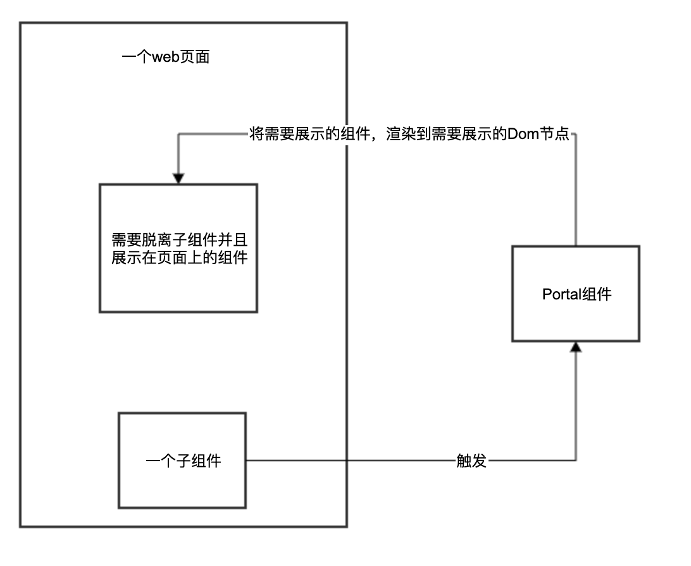

> github: [地址](https://github.com/zhangzewei/read-antd-code)
> gitbook: [地址](https://zhangzewei.gitbooks.io/read-antd-code/content/)

# 你真的知道 React Portal 吗？

> 作者：markzzw 时间：2019-12-19

## 简介

你知道 react portal 的前身今世么？这篇文章将会告诉你答案。

## 目录

1. [什么是 Portal 以及原](#什么是Portal以及原理)
2. [现在的 React Portal](#现在的React-Portal)
3. [以前的 React Portal](#以前的React-Portal)
4. [Portal 使用场景](#Portal使用场景)
5. [参考资料](#参考资料)

## 什么是Portal以及原理

`Portal` 提供了一种将子节点渲染到存在于父组件以外的 DOM 节点的优秀的方案。一个 `portal` 的典型用例是当父组件有 `overflow: hidden` 或 `z-index` 样式时，但你需要子组件能够在视觉上“跳出”其容器。例如，对话框、悬浮卡以及提示框

以上是 `React` 的[官方解释](https://zh-hans.reactjs.org/docs/portals.html)

### 配图



## 现在的React-Portal

在 `React16` 之后，`React` 提供了一个函数 `ReactDOM.createPortal(child, container)` 来渲染一个 `React 子元素` 到指定的 `container` 中，使用起来非常方便；

### React 官网的一个 Modal 的例子

这应该是现在大家所熟知的 `portal` 的一个用法

```js
const modalRoot = document.getElementById('modal-root');

class Modal extends React.Component {
  constructor(props) {
    super(props);
    this.el = document.createElement('div');
  }

  componentDidMount() {
    modalRoot.appendChild(this.el);
  }

  componentWillUnmount() {
    modalRoot.removeChild(this.el);
  }

  render() {
    return ReactDOM.createPortal(
      this.props.children,
      this.el,
    );
  }
}
```
## 以前的React-Portal

那么，在 `React` 没有提供 `createPortal()` 的时候，`Portal` 又该怎么实现呢？这里我们会使用另外一个方法 `ReactDOM.render(element, container[, callback])`；

### 使用 ReactDOM.render 的例子

```js
interface PortalProps extends CommonComponentProps {
  getContainer?: Function;
  visible?: boolean;
}

class Portal extends React.Component<PortalProps> {
  mountDom: HTMLElement;
  container: HTMLElement;
  constructor(props:PortalProps) {
    super(props);
    this.mountDom = document.createElement('div');
    this.container = props.getContainer
    ? props.getContainer()
    : window.document.body;
  }

  componentDidMount() {
    this.container.appendChild(this.mountDom);
  }

  componentWillUnmount() {
    if (this.mountDom) {
      this.container.removeChild(this.mountDom);
    }
  }

  getVisible = () => {
    if ('visible' in this.props) {
      return this.props.visible;
    }
    return true;
  }

  render() {
    const { children } = this.props;
    if (this.container && this.getVisible()) {
      if (createPortal) {
        return createPortal(children, this.mountDom);
      }
      ReactDom.render(children, this.mountDom);
    }
    return null;
  }
}

export default Portal;
```
甚至，在一些[代码](https://github.com/react-component/util/blob/master/src/ContainerRender.js)中还出现了使用 `ReactDOM.unstable_renderSubtreeIntoContainer(paren,component,container,callback);` 这些便是在 `createPortal` 方案没有出现的时候，一些解决方法；

## Portal使用场景

### 最熟悉的就是生成一个 `Modal` 或者是 `Dialog` 组件的时候；

```js
export interface DialogWrapperProps extends DialogProps {
  visible?: boolean;
  getContainer?: () => void;
}

class DialogWrapper extends Component<DialogWrapperProps>{
  render() {
    const { getContainer, children, onClose, visible } = this.props;
    if (visible) {
      return (
        <Portal
          visible={visible}
          getContainer={getContainer}
        >
          <Dialog
            onClose={onClose}
          >
            {children}
          </Dialog>
        </Portal>
      );
    }
    return null;
  }
}

export default DialogWrapper;
```
### 生成Dropdown的下拉菜单的时候

因为可以在任意节点挂载需要的 `React 元素`，所以我们也会需要在下拉组件中使用到 `Portal` 帮助我们完成这件事；

```js
class Trigger extends Component<TriggerProps, {
  triggerVisible: boolean
}> {
  popupContainer: HTMLElement;
  node: any;
  popupRef: any;
  clickPopupOutSideFun: void | null;

  constructor(props: TriggerProps) {
  }

  getPortalContainer = () => {...};

  creatPopupContainer = () => {...}

  getContainer = () => {...};

  render() {
    const {
      children,
      className
    } = this.props;

    const {
      triggerVisible
    } = this.state;

    const trigger = React.cloneElement(children, {
      className: classNames('pb-dropdown-trigger', className),
      ref: composeRef(this.node, (children as any).ref) // compose this component ref and children refs
    });

    let portal: React.ReactElement | null = null;
    if (triggerVisible) {
      portal = (
        <Portal
          key="portal"
          getContainer={this.getContainer}
        >
          {this.getPortalContainer()}
        </Portal>
      );
    }

    const newChildProps: HTMLAttributes<HTMLElement> & { key: string } = { key: 'trigger' };
    const child = (
      <div>
        {trigger}
        {portal}
      </div>
    );

    this.genNewChildren(newChildProps);
    
    const newChild = React.cloneElement(child, {
      ...newChildProps,
      ref: composeRef(this.node, (children as any).ref)
    });
    return newChild;
  }
}

export default Trigger;
```

## 参考资料

1. [react portal](https://zh-hans.reactjs.org/docs/portals.html)
2. [ReactDom.render](https://zh-hans.reactjs.org/docs/react-dom.html#render)
3. [antd portal](https://github.com/react-component/util/blob/master/src/Portal.js)
4. [本文中的Portal示例代码](https://github.com/zhangzewei/plan-b-design/blob/master/src/components/portal/Portal.tsx)
5. [本文中的Dropdown示例代码](https://github.com/zhangzewei/plan-b-design/blob/master/src/components/dropdown/Trigger.tsx)