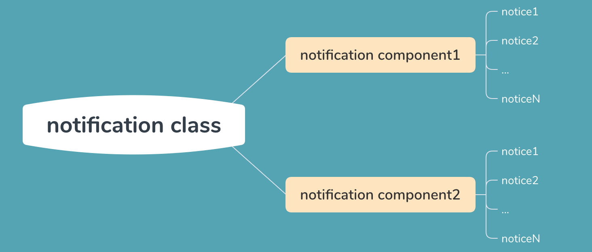

> github: [地址](https://github.com/zhangzewei/read-antd-code)
> gitbook: [地址](https://zhangzewei.gitbooks.io/read-antd-code/content/)

# Antd 是怎么使用 React 制作 notification 组件的

> 作者：markzzw 时间：2019-12-18 本文相关代码地址：[github](https://github.com/zhangzewei/plan-b-design/tree/master/src/components/notification)

## 简介

通过了解 `antd` 的制作方法以及观看源码，完成组件的简单实现；

## 目录

1. [中心思想](#core-mind)
2. [notification component](#notification-component)
3. [notice component](#notice-component)
4. [notification class](#notification-class)
5. [message component](#notification-component)
6. [参考资料](#reference)

## 中心思想

简单的来说就是使用 `notification component` 渲染出 `notice components`，然后使用 `notification class` 中的方法生成对应的位置的 `notification component`；

#### 配图



#### 为什么是这样的

先来看看 `antd` 是怎么使用 `notification` 组件的：`notification.open(config)`，可以看出，生成这个组件是使用的一个方法，而不是像写 `react` 那样直接写成 `<Component {...props} />`，所以最终使用的 `notification` 是一个实例化了的类，里面有一些方法能够生成 `notification component` 和 `notice component`；

## notification component

```ts
interface NotificationProps {
  maxCount?: number,
  closeIcon?: React.ReactNode,
}

class Notification extends React.Component<NotificationProps, {
  notices: NoticeProps[];
}> {
  constructor(props: NotificationProps) {
    super(props);
    this.state = {
      notices: [],
    }
  }

  addNotice = (notice: NoticeProps) => {
    const key = notice.noticeId = notice.noticeId || cuid();
    const { maxCount } = this.props;
    this.setState(previousState => {
      const notices = previousState.notices;
      const noticeIndex = notices.map(v => v.noticeId).indexOf(key);
      const updatedNotices = notices.concat();
      if (noticeIndex !== -1) {
        updatedNotices.splice(noticeIndex, 1, notice);
      } else {
        if (maxCount && notices.length >= maxCount) {
          updatedNotices.shift();
        }
        notice.key = notice.noticeId;
        updatedNotices.push(notice);
      }
      return {
        notices: updatedNotices,
      };
    });
  }

  removeNotice = (key: string) => this.setState(previousState => ({
      notices: previousState.notices.filter(n => n.noticeId !== key),
    }));

  render() {
    const { notices } = this.state;
    return <div className="notices">{notices.map((n: NoticeProps) => <Notice {...n} onClose={this.removeNotice} />)}</div>;
  }
}

export default Notification;
```
不难理解，我们使用 state 进行每个组件中的 notice 进行管理，然后将其渲染，相当于是每个实例中单独管理自己的 notice list，这里需要将其看做成为一个实例化的类，并且因为使用了 react 会因为 state 的改变而重绘，所以 state 是最佳载体

<h2 id="notice-component">notice component</h2>

```tsx
export interface NoticeProps extends CommonComponentProps {
  onClose: (key: string) => void;
  content: React.ReactNode;
  key: string;
  noticeId: string;
  duration?: number;
  disableIcon?: boolean;
}

class Notice extends React.Component<NoticeProps> {
  key: string;
  timer: NodeJS.Timeout | null;
  constructor(props: NoticeProps) {
    super(props);
    this.key = this.props.noticeId;
    this.timer = null;
  }

  componentDidMount() {
    const { duration, onClose } = this.props;
    if (duration) {
      this.timer = setTimeout(() => {
        onClose(this.key);
      }, duration);
    }
  }

  componentWillUnmount() {
    if (this.timer) {
      clearTimeout(this.timer as NodeJS.Timeout);
      this.timer = null;
    }
  }

  onMouseEnter = (e: React.MouseEvent) => {
    e.preventDefault();
    const { duration } = this.props;
    if (duration || this.timer) {
      clearTimeout(this.timer as NodeJS.Timeout);
      this.timer = null;
    }
  }

  onMouseLeave = (e: React.MouseEvent) => {
    e.preventDefault();
    const { duration, onClose } = this.props;
    if (duration) {
      this.timer = setTimeout(() => {
        onClose(this.key);
      }, duration);
    }
  }

  render() {
    const { className, content, noticeId, disableIcon, style, onClose } = this.props;
    const classname = classnames('pb-notice', className);
    const closeIcon = disableIcon ? null : (
      <div className="notice-close-btn" onClick={() => {
        onClose(this.key);
      }}>X</div>);
    return <div
      id={noticeId}
      className={classname}
      onMouseEnter={this.onMouseEnter}
      onMouseLeave={this.onMouseLeave}
      style={style}
    >
      <div className="notice-content">{content}</div>
      {closeIcon}
    </div>;
  }
}

export default Notice;
```
每一个 `notice` 便是我们消息的承载体，可以手动关闭，也可以设置关闭时间，在时间结束时关闭，并且为了更好的用户体验，在鼠标移动上去时清除掉定时器，移开时重新设置定时器，这样的用户体验还可以设置在轮播图这一类具有定时器的组件中，在鼠标移动上去的时候，不进行图片更换，移开之后再进行（可以适当变形，轮播图可以立即执行一次切换图片的动作）；

## notification class

```ts
type placementType = 
  'right-top' |
  'left-top' |
  'right-bottom' |
  'left-bottom' |
  'center-top';

export interface NotificationOptions {
  message: React.ReactNode;
  description?: React.ReactNode;
  className?: string;
  top?: number;
  bottom?: number;
  duration?: number | null;
  onClose?: (e: any) => void;
  placement?: placementType;
}

type messageType = 'info' | 'error' | 'succes' | 'warning';

interface MessageOptions extends NotificationOptions {
  type: messageType;
}

export interface NotificationInstanceProps extends NotificationOptions{
  container: HTMLElement;
}

export interface NotificationInstanceCallbackReturn {
  notice: (noticeProps: NoticeProps) => void,
  removeNotice: (key: string) => void,
  destroy: () => void,
  component: Notification,
  container: HTMLElement
}

class NotificationFactory {
  notifications: { [key: string]: { notification: NotificationInstanceCallbackReturn, div: HTMLDivElement } };
  defaultPlacement = 'right-top';
  constructor() {
    this.notifications = {};
  }
  
  private genClassName = (placement: placementType) => `pb-notifcation-${placement}`;

  private getContainer = (placement: placementType) => {
    if (get(this.notifications, [placement, 'div'], '')) {
      return this.notifications[placement].div;
    }
    const container = document.createElement('div');
    container.className = this.genClassName(placement);
    return container;
  };

  private genNotificationProps = (options: NotificationOptions) => {
    let props: any = {};
    const content = get(options, 'message', '');
    const duration = get(options, 'duration', null);
    props.content = content;
    if (duration) props.duration = duration;
    return props;
  }

  private genMessageProps = (options: MessageOptions) => {
    let props: any = {};
    const content = get(options, 'message', '');
    const duration = get(options, 'duration', 3000);
    const type = get(options, 'type', 'info');
    props.content = content;
    props.duration = duration;
    props.className = `pb-message pb-message-${type}`;
    props.disableIcon = true;
    return props;
  }

  getNotificationInstance = (
    props: NotificationInstanceProps,
    callback: (n: NotificationInstanceCallbackReturn) => void
  ) => {
    const div = props.container || document.createElement('div');
    document.body.appendChild(div);
    let called = false;
    function ref(notification: Notification) {
      if (called) {
        return;
      }
      called = true;
      callback({
        notice: (noticeProps: NoticeProps) => notification.addNotice(noticeProps),
        removeNotice: (key: string) => notification.removeNotice(key),
        component: notification,
        destroy: () => {
          ReactDOM.unmountComponentAtNode(div);
          div.parentNode && div.parentNode.removeChild(div);
        },
        container: div
      });
    }
    ReactDOM.render(<Notification {...props} ref={ref} />, div);
  };

  open = (
    options: NotificationOptions | MessageOptions,
    type: 'notice' | 'message'
  ) => {
    const placement = type === 'message'
      ? 'center-top'
      : get(options, 'placement', this.defaultPlacement) as placementType;

    const currentNotification = get(this.notifications, [placement, 'notification'], null);
    if (currentNotification) {
      currentNotification.notice(
        type === 'message'
        ? this.genMessageProps(options as MessageOptions)
        : this.genNotificationProps(options)
      );
    } else {
      const div = this.getContainer(placement);
      this.getNotificationInstance({
        container: div,
        ...options
      }, (n: NotificationInstanceCallbackReturn) => {
        this.notifications[placement] = {
          notification: n,
          div: n.container as HTMLDivElement
        }
        n.notice(
          type === 'message'
          ? this.genMessageProps(options as MessageOptions)
          : this.genNotificationProps(options)
        );
      });
    }
  }

  notice = (options: NotificationOptions) => {
    this.open(options, 'notice');
  }

  message = (options: MessageOptions) => {
    this.open(options, 'message');
  }
}

export default NotificationFactory;
```
我们使用 `NotificationFactory` 中的 `notice` 进行组件的渲染，那么我们来看看这个类做了些什么事情

1. 使用 `this.notifications[placement]` 存储每个位置上的内容，当做缓存
2. 调用 `open` 进行 `props` 和 `options` 的组装
3. 调用 `getNotificationInstance` 进行组件渲染，主要使用 `ReactDOM.render(<Notification {...props} ref={ref} />, div)` 将组件渲染到指定的 `DOM` 节点，这也是 `notification class` 的最主要的代码，为什么要使用 `ref`，因为还需要调用 `notification component` 的 `addNotice` 方法，但是因为使用了 `<Notification />` 的方式实例化了组件，所以如果需要获取到组件的实例，就需要用到 `ref`


## message component

`messages component` 与 `notification component` 其实是一个载体，只是展示的东西不同，所以只需要重新定义一些参数即可

## 参考资料

1. [antd-notification](https://github.com/ant-design/ant-design/blob/master/components/notification/index.tsx)
2. [rc-notification](https://github.com/react-component/notification)