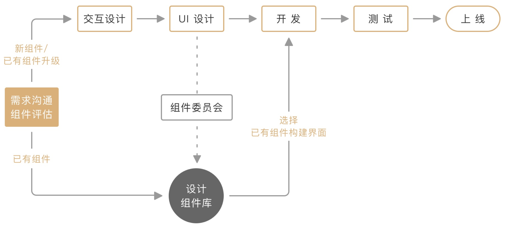
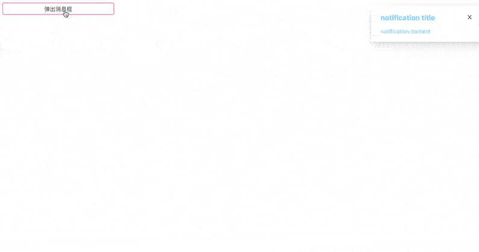
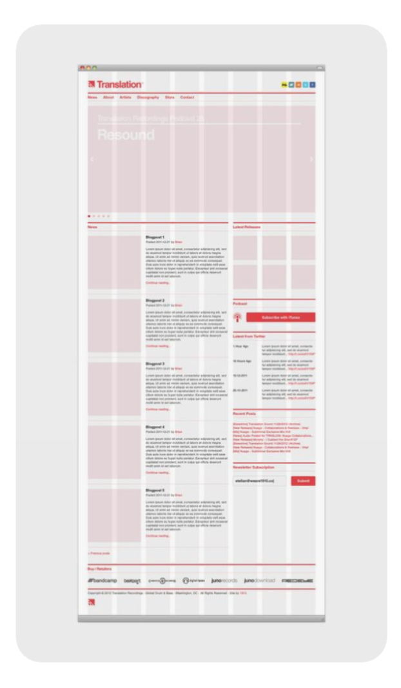

# design system 中需要注意什么

随着前端开发内容逐渐庞大，出现了很多不错的组件系统库，例如antd，element等。也有许多公司在开发着自己的组件库，制订一套自己的设计体系。

目录：

1. design system 的意义
2. atomic component 原则
3. css 样式原子化
4. 动画组件（动画系统）
5. 栅格组件（栅格系统）

## design system 的意义

对于一个公司或者一个体系来说，统一的设计系统的意义有以下几点：
1. 复用性
    
    新系统开发，不同团队使用，减少成本同时增加产出

2. 一致性

    设计有统一的参考标准，统一不同系统之间样式，规范统一，拥有一个组件库意味着不需要每次都重新造轮子，常规的并行式工作流程是：需求-需求沟通-交互设计-UI 设计-开发-测试-上线。
    
    [图片引用](https://zhuanlan.zhihu.com/p/99737118)

3. Brand 标志感

    Antd(蚂蚁金服)，Element-ui(饿了么)，Material design(Google)

## atomic component 原则

对于组件拆分和编写，设计系统中，是以原子化组件拆分原则为准的，那么什么为原子化组件呢，怎么定义的呢？

2013年，前端工程师Brad Forst将此理论运用在界面设计中，形成一套设计系统，其中包含了5个层面：原子、分子、组织、模板、页面，从小到大，从简到繁概括了整个产品中的界面设计。

1. 原子

    对于原子的定义为 design system 中最小的不可再分的组件，那么我们在网页中的拆分就应该是对应的 html 原生的标签加上对应的样式，也就是 input/h1/button 之类的组件，这类组件不能再次拆分，并且能够独立使用。

2. 分子

    对于分子的定义为 design system 中由原子组件构成的组件，比如带搜索按钮的搜索框/avatar(头像和名字的展示组件)/card(卡片组件)等

3. 组织

    对于组织的定义为 design system 中由原子和分子构成的组件，这类组件一般具有一定的业务能力，比如 tab组件/datepicker组件/XX列表组件等

4. 模板

    对于模板的定义为 design system 中由原子、分子、组织构成的没有数据的高复用界面，比如后台管理系统的表格页面，这个页面具有高复用性。

5. 页面

    对于页面的定义就是，将模板用数据进行填充之后，展示的真实页面，也称作为高保真页面。

## css 样式原子化

原子化的组件开发，也引出了样式的原子化，简单讲讲样式原子化也就是将我们整个系统中的基础样式定义为单独的 class 例如：

```css
.font-size-24 {
  font-size: 24px;
}

.padding-10 {
  padding: 10px;
}
```
这样的 class 的定义可以减少重复的样式编写，如果我们使用的是变量的形式，那么势必在每个组件中使用到一样的样式时，会写重复的一句
```scss
$font-size24: 24px;

.article-title {
  font-size: $font-size24;
}

.introduction-title {
  font-size: $font-size24;
}
```
那么编译之后就会是重复的代码，会有两行 `font-size: 24px;` 存在于 css 打包代码中，如果使用的原子化的 class，只会编译一句 `font-size: 24px;` 在 css 代码中，只是需要在使用的地方多写一些样式名。

## 动画组件（动画系统）

在一个设计完善的设计系统中，动效的设计必定是需要的，动效系统的意义：

1. 重要性
  
    引导用户，暗示元素间的等级和空间关系，让用户忽视系统背后发生的事情
2. 好的转换
    
    快速的，动画要简单明了，动效是一个整体
3. Animate.css
    
    现成的动画css库，丰富的动效，拓展性高

例如使用 vuejs 中的 transition + animate.css，构建的动效系统，只需要套在需要使用动效的组件外部即可使用：

```jsx
// animate.vue
<template>
  <transition
    name=""
    :enter-active-class="enterClass"
    :leave-active-class="leaveClass"
    @after-leave="afterLeave"
    @after-enter="afterEnter"
  >
    <slot></slot>
  </transition>
</template>

<script>
export default {
  name: 'MyAnimate',
  props: {
    enter: {
      type: String,
      default: 'fadeIn'
    },
    leave: {
      type: String,
      default: 'fadeOut'
    },
    afterLeave: {
      type: Function,
      default: function() {},
    },
    afterEnter: {
      type: Function,
      default: function() {},
    }
  },
  computed: {
    enterClass: function() {
      return `animated ${this.enter}`;
    },
    leaveClass: function() {
      return `animated ${this.leave}`;
    }
  }
}
</script>
```
在 notification 组件中使用
```jsx
// notification.vue
// :enter / :leave 的参数是对应的 animate.css 中的 class

<template>
  <MyAnimate
    :enter="'slideInRight'"
    :leave="'fadeOutUp'"
    :afterLeave="afterLeave"
  >
    <div class="notification" :style="style" v-show="visible" @mouseenter="clearTimer" @mouseleave="createTimer">
      <div class="notification-head">
        <span class="title">{{title}}</span>
        <a class="notice-btn" @click.stop.prevent="handleClose"><icon :name="'close'"></icon></a>
      </div>
      <span class="notification-content">{{content}}</span>
    </div>
  </MyAnimate>
</template>
```


动效组件的建立能够减少在后续中的开发成本，提升效率，并且在开发组件的时候必要的动效是必须的。

## 栅格组件（栅格系统）



栅格系统最早源自于报刊的排版，后来应用于网页的布局排版，栅格布局减少了设计师与开发的交流成本，并且能够使得网页能够适应于各种屏幕下展示：

1. 合理布局

    根据栅格大小，决定主次，快速布局
2. 响应式

    不同屏幕大小下，所占栅格大小不同
3. 规范化

    出现于早期报纸的布局方式，沿用至今，规范统一，减少设计师与开发沟通成本

