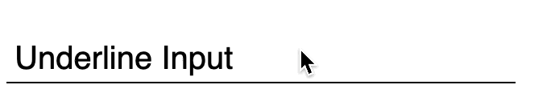
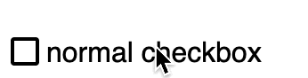
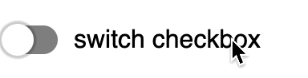
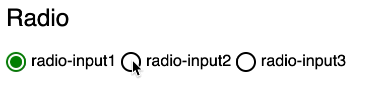
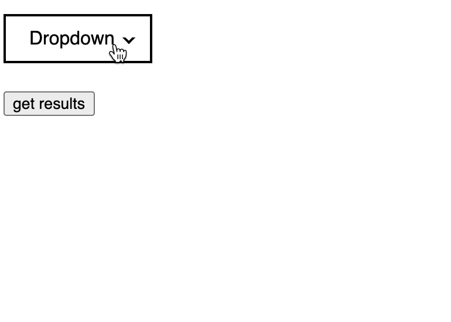

# 表单的魔法
在前端开发中，有很多时候会用到表单，但是表单的原始样式都是很简陋的样式，很多都不符合设计师的设计，于是就有很多人使用其他的 html 元素，对表单元素进行模仿，例如：使用 div 或者其他元素模拟 checkbox 的勾选效果，但是这就不符合 html 的使用标准，即使用正确的标签。

其实在 html 标签中，我们可以使用 label 标签对原有标签进行复写样式或者更改样式以下是几个例子，做这个分享主要目的是希望大家能够使用正确的标签，来达到一个较为标准的 html 结构，也想要分享给大家一些常见的表单 css 伪类的使用，也希望大家能够在使用别人的组件的时候，留个心眼去查看源码，学习他人是如何编写优雅美观的代码的。

> codepen 地址：https://codepen.io/zhangzewei/details/dyOQeex

## input

输入框作为最常见的 form 元素，也是最容易进行改造的

### 改造方案一

Normal Input

普通的输入框美化

1. 需要给 border 添加上样式：normal，focus，error
2. 可以适当添加上圆角
3. 使用 label 配合 input 取代 placeholder，并且 label 跟 input 各占一行，因为 placeholder 作为提示，在用户输入之后就会被遮挡住，各占一行是因为，在同一行的话，某些提示较长的时候，会很影响布局
4. input 内部需要有 padding 撑开，让文字和边框具有一定的间隔

### 改造方案二

Underline Input

使用 label 作为 placeholder

该方案也可以变形，不一定是需要 input 框为一根横线，方框也可以，具体可以看设计师如何设计，并且浏览器兼容性也更有保障

1. 使用 label 作为 placeholder 使用绝对定位放在输入框中
2. 使用 input 的 focus 伪类，更改 label 的样式，即 focus 的时候，label 缩小到上方，在没有 focus 的时候，放回原位
3. 使用 js 控制样式，当 input 框有内容时，添加样式，让 label 保持为 focus 时的样式

## checkbox

很多时候，为了达到设计师对复选框的设计，很多开发会使用其他的元素代替原生的 `<input type="checkbox" />` ，但是这个方案其实是不符合正确使用 html 标签的标准的。

主要使用 input 和 label 配合使用，达到效果的同时，满足正确使用 html 标签，同时兼容性还不错，一举三得

### 改造方案一

Normal checkbox

使用 label 的 for 属性和 input 的 id 进行绑定特性进行改造
1. 将 input 和 label 写在一起，然后隐藏 input
2. 使用 label 的 `before` & `after` 伪类，重新构造勾选框的样式
3. 使用 input 的 `checked` 伪类，改变 label 的 `before` & `after` 样式

### 改造方案二

Switch

其实 checkbox 的属性就是一个开关，即 0 或 1 的选择，所以当我们需要一些开关的时候，也可以使用 checkbox 来进行变形。

改造方案如上，只是 label 的 `before` & `after` 样式上不一样。

## radio

### Normal radio

同样是使用 input 的 `checked` 伪类进行样式的复写。
1. 隐藏 input
2. 使用 label 的 `before` & `after` 制作圆圈和被选中之后的圆点

## select

### Normal select

select 组件是可以使用 padding 将其内部撑开，达到一定的美化效果，但是其选项 option 并不能添加优美的样式。

### Dropdown

可以使用 checkbox + select 组件达到效果，checkbox 作为展示组件，利用 checked 状态，作为 dropdown 的打开开关，select 作为真实 form 组件存储值。
1. dropdown 下的 input 和 select 都隐藏
2. checkbox 的 `checked` 伪类配合 css 动画，做出下拉效果
3. 使用 js 给选项绑定点击事件，进而修改 select 的值

## 画龙点睛

在以上的例子里，其实都是使用的 css 伪类进行原有样式的修改，这样的好处有：
1. 能够统一在不同浏览器上的样式，增强兼容性
2. 使用正确的 html 标签进行表达
3. 能够自定义样式，可操作空间很大，能够满足大部分设计上的要求，例如：最简单的动画要求

## 结语
在书写 html 时，要记得使用正确的 html 标签进行表达，并且在能力范围内，尽量满足设计要求，在细节处，最好有动画修饰，使得交互更加细腻。