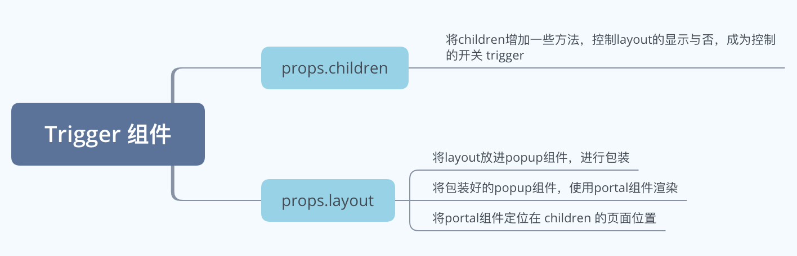

> github: [地址](https://github.com/zhangzewei/read-antd-code)
> gitbook: [地址](https://zhangzewei.gitbooks.io/read-antd-code/content/)

# Antd 中的 Trigger 是什么？

> 作者：markzzw &nbsp;&nbsp;&nbsp; 时间：2019-12-30 &nbsp;&nbsp;&nbsp; 本文相关代码地址：[github](https://github.com/zhangzewei/plan-b-design/blob/master/src/components/dropdown/Trigger.tsx)

## 目录 

1. [简介 + 实现原理](#简介+实现原理)
2. [Trigger怎么控制Popup的显示与否](#Trigger怎么控制Popup的显示与否)
3. [定位 Popup & composeRef](#定位Popup&composeRef)
4. [点击 Popup 外部进行关闭操作 - clickOutSide](#点击Popup外部进行关闭操作-clickOutSide)
5. [参考资料](#参考资料)

## 简介+实现原理

`Trigger` 组件是 `Antd` 的一个重要的组件，作用是在触发点周围或者其他地方展示一些相关信息，比如 `Tooltip Dropdown` 内部均是使用 `Trigger` 组件完成的，当然还有一些定位以及动画组件的包裹，我们这里可以忽略；

它的实现原理也很简单，进行以下几个步骤就可以实现，也是较为常见的一个实现方式，个人觉得这样的实现方式来实现 `Tooltip Dropdown` 是较为合理的，因为定位方面可以比较方便计算；

实现步骤：

1. 有一个页面元素或者组件作为触发器 `Trigger` 将其包裹起来；
2. 在 `Trigger` 中把包裹起来的 `children` 进行一些包装；
3. 将需要显示的内容使用 `Portal` 组件展示，在 `Trigger` 组件中进行显示与否的控制；

图示：



## Trigger怎么控制Popup的显示与否

+ Trigger
```tsx
class Trigger extends Component<TriggerProps, {
  popupVisible: boolean;
}> {
  popupContainer: HTMLElement;
  node: any;
  popupRef: any;
  clickPopupOutSideFun: void | null;
  delayTimer: ReturnType<typeof setTimeout> | null;

  constructor(props: TriggerProps) {
    super(props);
    this.state = {
      popupVisible: false,
    };
    this.popupContainer = this.creatPopupContainer();
    this.delayTimer = null;
  }

  getPortalContainer = () => {
    const {
      popup,
      popupClassName,
      popupStyle,
    } = this.props;
    const { popupVisible } = this.state;
    const mouseProps: HTMLAttributes<HTMLElement> = {};

    if (this.isHoverToHideOrShow()) {
      mouseProps.onMouseEnter = this.onPopupMouseEnter;
      mouseProps.onMouseLeave = this.onPopupMouseLeave;
    }

    return (
      <Popup
        {...mouseProps}
        className={popupClassName}
        style={popupStyle}
        point={this.getRefPoint()}
        visible={popupVisible}
        ref={composeRef(this.popupRef)}
      >
        {typeof popup === 'function' ? popup() : popup}
      </Popup>
    );
  };

  creatPopupContainer = () => {
    const popupContainer = document.createElement('div');
    popupContainer.style.position = 'absolute';
    popupContainer.style.top = '0';
    popupContainer.style.left = '0';
    popupContainer.style.width = '100%';
    return popupContainer;
  };

  getContainer = () => {
    const { props } = this;
    if (!this.popupContainer) {
      this.creatPopupContainer();
    }
    const mountNode = props.getPopupContainer
      ? props.getPopupContainer()
      : window.document.body;
    mountNode.appendChild(this.popupContainer);
    return this.popupContainer;
  };

  isHoverToHideOrShow = () => {
    const { action } = this.props;
    return action.indexOf('hover') !== -1;
  };

  delaySetPopupVisible = (visible: boolean, delayS: number, event: React.MouseEvent) => {
    this.clearDelayTimer();

    if (delayS === 0 || !!delayS) {
      event.persist(); // https://reactjs.org/docs/events.html#event-pooling
      this.delayTimer = setTimeout(() => {
        this.setPopupVisible(visible, event);
      }, delayS * 1000);
      return;
    }

    this.setPopupVisible(visible, event);
  };

  setPopupVisible = (visible: boolean, event: React.MouseEvent) => {
    if (this.state.popupVisible !== visible) {
      this.setState({ popupVisible: visible });
      this.props.onVisibleChange && this.props.onVisibleChange(visible, event);
    }
  };

  clearDelayTimer = () => {
    if (this.delayTimer) {
      clearTimeout(this.delayTimer);
      this.delayTimer = null;
    }
  };

  onMouseEnter = (e: React.MouseEvent) => {
    this.delaySetPopupVisible(true, 0, e);
  };

  onMouseLeave = (e: React.MouseEvent) => {
    this.delaySetPopupVisible(false, 0, e);
  };

  onPopupMouseEnter = () => {
    this.clearDelayTimer();
  };

  onPopupMouseLeave = (e: React.MouseEvent) => {
    this.delaySetPopupVisible(false, 0, e);
  };

  render() {
    const {
      children,
      className,
    } = this.props;

    const { popupVisible } = this.state;

    const childProps: HTMLAttributes<HTMLElement> = {};

    if (this.isHoverToHideOrShow()) {
      this.clearOutsideHandler();
      childProps.onMouseEnter = this.onMouseEnter;
      childProps.onMouseLeave = this.onMouseLeave;
    }

    const trigger = React.cloneElement(children, {
      className: classNames('pb-dropdown-trigger', className),
      ...childProps,
      ref: composeRef(this.node, (children as any).ref),
    });

    let portal: React.ReactElement | null = null;
    if (popupVisible) {
      portal = (
        <Portal
          key="portal"
          getContainer={this.getContainer}
        >
          {this.getPortalContainer()}
        </Portal>
      );
    }

    return [
      trigger,
      portal,
    ];
  }
}
```

上面代码展示了最简单的 `hover` 在 `trigger` 上的时候就展示，离开后消失的代码，但是得注意一点就是需要在 `hover` 在 `popup` 上的时候也需要展示 `popup`，并且在鼠标从 `trigger` 移动到 `popup` 上的过程中 `popup` 不消失（不会出现闪烁的情况），从代码中看出 `popup` 是使用 `portal` 组件渲染的，是和 `trigger` 分开来的，所以不能单纯的直接通过 `trigger` 的 `mouseenter mouseleave` 事件控制 `popup` 的展示，否则 `popup` 就会在移动的过程中消失；

这里使用的是一个很巧妙的方法，`settimeout` 去将关闭的操作放入函数栈中，当当前函数执行完成之后，就会执行之前放在栈中的 `settimeout`，依据这个特点，在 `popup` 的 `mouseenter` 事件中添加了清楚当前定时器的操作，`mouseleave` 事件中添加了新的定时器的操作，那么函数执行的顺序将是：
```js
triggerMouseEnter(set a opentimer) ->
triggerMouseLeave(clear last opentimer & set a closetimer) ->
popupMouseEnter(clear last closetimer) ->
popupMouseLeave(set a closetimer) ->
last closetimer(trigger close function)
```
在 `popupMouseEnter` 的时候，去掉了函数栈的中的 `timer`，然后再鼠标移开 `popup` 与 `trigger` 之外的时候在去加上 `close` 的 `timer`，关闭了 `popup`；

这里最开始会有一些关于settimeout的疑问，我的疑问是设置了delay=0为什么不会立刻关闭，在[这里](https://www.jianshu.com/p/fc9a08ca2c92)我找到了解答：`setTimeout，setInterval都存在一个最小延迟的问题，虽然你给的delay值为0，但是浏览器执行的是自己的最小值。HTML5标准是4ms，但并不意味着所有浏览器都会遵循这个标准，包括手机浏览器在内，这个最小值既有可能小于4ms也有可能大于4ms。在标准中，如果在setTimeout中嵌套一个setTimeout, 那么嵌套的setTimeout的最小延迟为10ms`，这篇文章还有其他的内容写得不错可以看看；

在 `settimeout` 之前我们做了一个操作 `event.persist()`，这个操作的原因是因为 `react` 会将事件池清空在异步的情况下，而 `event.persist()` 会将其保留下来不会被清空掉，所以需要在 settimeout 之前使用这个函数，来将这次的事件保留下来进行传递；

## 定位Popup&composeRef
在 `Popup` 的 `props` 中有一个是 `points`，代表了 `Popup` 渲染之后的位置，需要得到当前 `trigger` 的坐标才能够算出 `Popup` 的显示的位置，这个时候就需要使用到 `ref` 来获取到当前渲染的 `trigger` 的 `dom` 节点，`trigger` 是外部传入的 `children`，不能够像`<Component ref={function} />` 的方式获取到 `trigger` 的 `ref`，而 `React.cloneElement` 可以帮助解决这个问题，通过 `composeRef` 以及 `fillRef` 两个函数，分别完成 `this.node` 以及 `children` 的 `ref` 映射，都映射在新 `clone` 的这个组件上，

+ Trigger.tsx
```jsx
export function fillRef<T>(ref: React.Ref<T>, node: T) {
  if (typeof ref === 'function') {
    ref(node);
  } else if (typeof ref === 'object' && ref && 'current' in ref) {
    (ref as any).current = node;
  }
}

export function composeRef<T>(...refs: React.Ref<T>[]): React.Ref<T> {
  return (node: T) => {
    refs.forEach(ref => {
      fillRef(ref, node);
    });
  };
}

class Trigger extends React.Component {
  ...
  getRefPoint = () => {
    if (this.node.current) {
      return offset(this.node.current);
    } else {
      return {
        left: 0,
        top: 0,
      };
    }
  };
  ...
  render () {
    ...
    const trigger = React.cloneElement(children, {
      className: classNames('pb-dropdown-trigger', className),
      ...childProps,
      ref: composeRef(this.node, (children as any).ref),
    });
  }
}
```


## 点击Popup外部进行关闭操作-clickOutSide
关于 `clickOutSide` 关闭 `Popup` 的由来：是因为这是 `html` 的下拉菜单（`select`）的默认行为，或者说这是浮窗一类的默认行为，也是为了遵从网络无障碍辅助功能，当当前展开按钮是去焦点时，需要将其产生的 `side-effect` 消除掉；
通常实现这个功能的方法是在 `window` 对象中附上一个 `click` 事件以关闭弹窗：
+ react 官网例子
```js
componentDidMount() {
  window.addEventListener('click', this.onClickOutsideHandler);
}
componentWillUnmount() {
  window.removeEventListener('click', this.onClickOutsideHandler);
}
onClickOutsideHandler(event) {
  if (this.state.isOpen && !this.toggleContainer.current.contains(event.target)) {
    this.setState({ isOpen: false });
  }
}
```
+ Trigger.tsx
```tsx
onClickPopupOutSide = (e: React.MouseEvent) => {
  if (contains(this.node.current, e.target)) return;
  if (this.state.popupVisible && contains(this.popupRef.current, e.target)) return;
  this.setPopupVisible(false, e);
}
clearOutsideHandler() {
  if (this.clickPopupOutSideFun) {
    window.document.removeEventListener('click', (this.clickPopupOutSideFun as any));
    this.clickPopupOutSideFun = null;
  }
}

render () {
  ...
  if (this.isClickToHideOrShow()) {
    childProps.onClick = this.onClick;
    this.clickPopupOutSideFun = window.document.addEventListener('click', this.onClickPopupOutSide as any);
  }
  ...
}
```
可是光是在外部使用 `ref` 是不能够获取到 `Popup` 组件内部实际的 `dom` 节点的 `ref` 的，这时需要用到 `React.forwardRef`，将 `ref` 作为参数往下传递，这样子就能够在 `Trigger` 组件中获取到 `Popup` 组件中的 `dom` 的 `ref`，然后可以根据点击事件判断点击的 `dom` 节点是否包含在 `Trigger` 组件中
+ Popup.tsx
```tsx
const Popup: React.RefForwardingComponent<HTMLDivElement, PopupProps> = (props, ref) => {
  const {
    point,
    children,
    style,
    className,
    visible,
    hiddenClassName,
    ...others
  } = props;
  const popupStyle: React.CSSProperties = {
    ...point,
    position: 'absolute',
  };
  return (
    <div
      className={classNames('pb-trigger-popup')}
      style={popupStyle}
      ref={ref}
      {...others}
    >
      <div
        className={classNames(className, !visible && `${hiddenClassName}`)}
        style={style}
      >
        {children}
      </div>
    </div>
  );
};
const RefPopup = React.forwardRef<HTMLDivElement, PopupProps>(Popup);
RefPopup.displayName = 'Popup';
export default RefPopup;
```
## 参考资料

1. [setTimeout机制](https://www.jianshu.com/p/fc9a08ca2c92)
2. [react中怎么在异步函数中传递event](https://reactjs.org/docs/events.html#event-pooling)
3. [react ref](https://zh-hans.reactjs.org/docs/refs-and-the-dom.html)
4. [React.cloneElement](https://zh-hans.reactjs.org/docs/react-api.html#cloneelement)
5. [网络无障碍辅助功能](https://zh-hans.reactjs.org/docs/accessibility.html)
6. [React.forwardRef](https://zh-hans.reactjs.org/docs/react-api.html#reactforwardref)
7. [你真的知道 React Portal 吗？](https://github.com/zhangzewei/read-antd-code/blob/master/story/core-mind/do-you-know-portal.md)