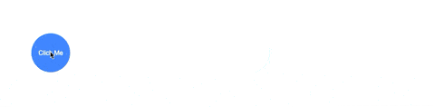

## sass 数字的运算

## 目录
1. 简介
2. 简单运算及要点
3. 实际的例子说明

### 1.简介
sass 作为一种预编译语言，也可以进行运算，数字运算作为运算中最常见的运算，包含了 `+、-、*、/、%` 等运算，运用这些数字运算，能够提升样式中的精确度，以完成一些复杂的样式制作。

### 2.简单运算及要点

#### 一般数字运算

```scss
p {
  font: 10px/8px;             // 纯 CSS，不是除法运算
  $width: 1000px;
  width: $width/2;            // 使用了变量，是除法运算
  width: round(1.5px)/2;        // 使用了函数，是除法运算
  height: (500px/2);          // 使用了圆括号，是除法运算
  margin-left: 5px + 8px/2px; // 使用了加（+）号，是除法运算
  padding-left: + 100px / 2;  
}

// 编译后

p {
  font: 10px/8px;
  width: 500px;
  width: 1px;
  height: 250px;
  margin-left: 9px;
  padding-left: 50px;
}
```
+ Tips

  `/` 符号在 css 中作为分隔符号存在，sass 当中它还有除法的功能，以下三种情况 `/` 将被视为除法运算符号：
  1. 如果值，或值的一部分，是变量或者函数的返回值
  2. 如果值被圆括号包裹
  3. 如果值是算数表达式的一部分

  如果需要使用变量，同时又要确保 `/` 不做除法运算而是完整地编译到 css 文件中，只需要用 `#{}` 插值语句将变量包裹 
```scss
  $font-size: 12px;
  $line-height: 30px;
  font: #{$font-size}/#{$line-height};
  // 编译为
  font: 12px/30px;
```

#### 除了十进制的计算，也可以进行其他进制计算，比如计算16进制的颜色

计算方法是两两相加 `00 + 04、11 + 05、00 + 06`；

```scss

p {
  color: #001100 + #040506;
}
p {
  color: #010 + #040506; // #010 = #001100
}

// 编译后

p {
    color: #041606;
}

p {
    color: #041606;
}
```
+ Tips

  需要注意的是，如果颜色值包含 alpha channel（rgba 或 hsla 两种颜色值），必须拥有相等的 alpha 值才能进行运算，因为算术运算不会作用于 alpha 值。

```scss
p {
  color: rgba(255, 0, 0, 0.75) + rgba(0, 255, 0, 0.75);
}

// 编译后

p {
  color: rgba(255, 255, 0, 0.75);
}
```

#### 实际的例子说明

简介：一个导航按钮弹出的例子，利用checkbox状态来控制按钮的显示与否，不需要使用js就能完成的动画

1. 水平展开的按钮组
  
    利用for循环以及计算，就能够算出动画之后每个按钮的位置，水平放置的按钮只需要计算水平的位置



index.html
```html
<div className="demo-container">
  <div className="popping-menu">
    <input className="checkbox" id="checkbox" type="checkbox" />
    <button>hello1</button>
    <button>hello2</button>
    <button>hello3</button>
    <button>hello4</button>
    <button>hello5</button>
    <button>hello6</button>
    <label className="label" htmlFor="checkbox">Click Me</label>
  </div >
</div >
```
style.scss
```scss
$d: 9em;
.demo-container {
  height: 100vh;
  width: 100%;
  display: flex;
  align-items: center;
  justify-content: center;
  overflow: auto;

  .popping-menu {
    position: relative;
    width: 10em;
    height: 10em;
    display: flex;
    justify-content: center;
    align-items: center;
    button {
      position: absolute;
      display: block;
      width: 4em;
      height: 4em;
      appearance: none;
      background: #FFB66F;
      border: none;
      transition: all 0.3s ease-in-out;
      opacity: 0;
      border-radius: 50%;
      color: white;
    }  
  
    .checkbox {
      display: none;
    }
    .checkbox:checked {
      ~ button {
  
        $per: 30;
        @for $i from 1 through 6 {
          &:nth-of-type(#{$i}) {
            $width: $i * 5.5em; // 每个按钮宽度是 4em 然后间距1.5em $i * 4em + $i * 1.5em => $i * 5.5em
            opacity: 1;
            transition-delay: 0.1s * $i; // 时间计算也是需要考虑上一个动画完成的时间
            margin-left: $width;
          }
        }
      }

      ~ .label {
        transform: rotate(360deg) ;
      }
    }
    .label {
      z-index: 10;
      border-radius: 50%;
      background: #4791FF;
      width: 6em;
      height: 6em;
      line-height: 6em;
      text-align: center;
      display: block;
      color: white;
      cursor: pointer;
      user-select: none;
      transition: all .9s ease-in-out;
    }
  }  
}
```

2. 圆弧展开的按钮组

因为sass的数字计算不仅仅是一般的数字的加减乘除，还可以使用函数，使用数学库中的正弦函数余弦函数就能够实现计算圆弧展开按钮组的按钮位置


style.scss 
```scss
@import "mathsass/dist/_math.scss";
$d: 9em;
button {
  position: absolute;
  display: block;
  width: 4em;
  height: 4em;
  appearance: none;
  background: #FFB66F;
  border: none;
  transition: all 0.3s ease-in-out;
  transform: translate(0, 0) rotate(360deg);
  opacity: 0;
  border-radius: 50%;
  color: white;
}  

.checkbox {
  display: none;
}
.checkbox:checked {
  ~ button {
    // 以中间按钮为圆心画一个半径为 $d: 9em 的圆，然后将按钮一一排放在圆弧上
    $per: 30;
    @for $i from 1 through 6 {
      &:nth-of-type(#{$i}) {
        $angle: $per * ($i - 1) * 1deg + 180deg; // 加上180deg是因为在网页中 X轴的正方向是水平向右 Y轴的正方向是垂直向下
        $x: cos($angle) * $d;
        $y: sin($angle) * $d;
        opacity: 1;
        transition-delay: 0.1s * $i;
        transform: translate($x, $y) rotate(360deg) ;
      }
    }
  }

  ~ .label {
    transform: rotate(360deg) ;
  }
}
```
将刚才的样式代码中的相应代码替换成上面代码所示，就能够实现圆弧展开的按钮组