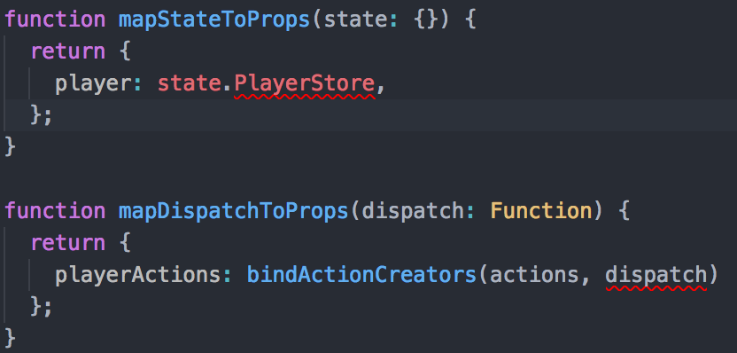

# 背景

最近在看antd源码，也在自学一些typescript的语法以及使用，然后准备带在学校的师弟做一个音乐播放器作为typescript的练习踩踩坑；

然后竟然没想到在项目刚开始就深陷大坑--搭建react-redux项目流程，一下内容就是记录我是怎样从这个深坑中爬出来的过程。

# 开始？根本开始不起来

从项目创建之后就掉坑里了。。。

## 创建项目
创建项目的流程很简单，可有参考我之前写的这篇[文章](https://juejin.im/post/59e9c1c36fb9a0451f3012b6)

## 从mapStateToProps&mapDispatchToProps开始爬坑

刚开始还不是很熟悉typescript，所以我最开始的reducer, action, constant,文件都是以.js结尾，只有组件的代码是以.tsx结尾的，然后就开始按照流程，将store中的state进行mapStateToProps以及actions进行mapDispatchToProps，谁想到这竟然是噩梦的开始，最开始我是这样写的代码:

```js
  import { bindActionCreators } from 'redux';
  function mapStateToProps(state: {}) {
    return {
      player: state.PlayerStore,
    };
  }

  function mapDispatchToProps(dispatch: Function) {
    return {
      playerActions: bindActionCreators(actions, dispatch)
    };
  }
```

然后就开始报错了。。。



几经折腾之后我又将代码改成了这样，才得以过关

```js
  import { bindActionCreators, Dispatch } from 'redux';
  function mapStateToProps(state: { PlayerStore: object }) {
    return {
      player: state.PlayerStore,
    };
  }

  function mapDispatchToProps(dispatch: Dispatch<{}>) {
    return {
      playerActions: bindActionCreators<{}>(actions, dispatch)
    };
  }
```

## 爬坑react组件断言类型

```js
  interface PlayerPropsClass {
    player: PlayerStateTypes;
    playerActions: actions.PlayerActionsTypes;
  }
  class Player extends React.Component<PlayerPropsClass, {}> {
    constructor(props: object) {
      super(props as PlayerPropsClass);
      this.state = {};
    }

    addOne = (num: number) => this.props.playerActions.count(num);

    subtractOne = (num: number) => this.props.playerActions.subtract(num);

    render() {
      const { countNumber } = this.props.player.toJS();
      return (
        <div className="player">
          <span>{countNumber}</span>
          <button onClick={() => this.addOne(countNumber as number)}>点击+1</button>
          <button onClick={() => this.subtractOne(countNumber as number)}>点击-1</button>
        </div>
      );
    }
  }
  
  export default connect(mapStateToProps, mapDispatchToProps)(Player as any);
```
这里的(Player as any)报错提示

```
  [tslint] Type declaration of 'any' loses type-safety. Consider replacing it with a more precise type, the empty type ('{}'), or suppress this occurrence. (no-any)
```

然后我改成

```js
  export default connect(mapStateToProps, mapDispatchToProps)(Player as {});
```

仍然报错

```
  [ts]
  类型“{}”的参数不能赋给类型“ComponentType<{ player: object; } & { playerActions: {}; }>”的参数。
  不能将类型“{}”分配给类型“StatelessComponent<{ player: object; } & { playerActions: {}; }>”。
  类型“{}”提供的内容与签名“(props: { player: object; } & { playerActions: {}; } & { children?: ReactNode; }, context?: any): ReactElement<any> | null”不匹配。
```

哇心态爆炸，都不知道怎么写这个断言。。。然后我想起了antd的一个例子，写的是`React.ReactElement`，然后偶然间在网上找到了说的是在node_modules中有一个@type文件夹就是typescript对于node包中的相应的类型匹配，于是我就按照这个路径`node_modules/@types/react/index.d.ts`，终于找到了`React.ComponentType<T>`，这个文件里面还有很多的类型，想要了解的可以自己去看看

```js
  export default connect(mapStateToProps, mapDispatchToProps)(Player as React.ComponentType<PlayerPropsClass>);
```

## 爬坑action和reducer

有了以上的经验，再加上在[这里](https://github.com/piotrwitek/react-redux-typescript-guide#stateful-components---class)看了一些代码，我决定把actions和reducer也改为ts结尾的文件；

+ src/reducers/index.ts

  ```js
    import { combineReducers, createStore } from 'redux';
    import PlayerStore from '../containers/Player/reducer';

    // 这个是用来使用到mapStateToProps函数的地方给state进行类型检测的
    export interface AppStoreType {
      PlayerStore: object;
    }

    const rootReducer = combineReducers({
      PlayerStore,
    });

    export default () => {
      return createStore(rootReducer);
    };
  ```

+ containers/Demo/reducer.ts
  
  ```js
    import * as PlayerTypes from './constant';
    import { fromJS } from 'immutable';
    // 由于使用到immutable，state上面就会使用到immutable的函数，所以需要将其也做成类型检测
    import { ImmutableFuncType } from '../../constant';

    interface ActionType {
      type: string;
      countNumber?: number;
    }

    interface StoreType {
      countNumber: number;
    }
    // 把当前容器的state组，然后抛出提供使用
    export type PlayerStateTypes = StoreType & ImmutableFuncType;

    const PlayerStore: PlayerStateTypes = fromJS({
      countNumber: 0,
    });

    export default (state = PlayerStore, action: ActionType) => {
      switch (action.type) {
        case PlayerTypes.COUNT:
          return state.update('countNumber', () => fromJS(action.countNumber));
        default:
          return state;
      }
    };
  ```

+ containers/Demo/action.ts

  ```js
    import * as PlayerTypes from './constant';

    export const count = (num: number) => ({
      type: PlayerTypes.COUNT,
      countNumber: num + 1,
    });

    export const subtract = (num: number) => ({
      type: PlayerTypes.COUNT,
      countNumber: num - 1,
    });
    // 抛出actions函数的类型以供mapDispatchToProps使用
    export interface PlayerActionsTypes {
      count: Function;
      subtract: Function;
    }
  ```

+ containers/Demo/index.tsx

  ```js
    import * as React from 'react';
    import './style.css';
    import { connect } from 'react-redux';
    import { bindActionCreators, Dispatch } from 'redux';
    import * as actions from './action';
    import { PlayerStateTypes } from './reducer';
    import { AppStoreType } from '../../reducers';

    interface PlayerPropsClass {
      player: PlayerStateTypes;
      playerActions: actions.PlayerActionsTypes;
    }

    function mapStateToProps(state: AppStoreType) {
      return {
        player: state.PlayerStore,
      };
    }

    function mapDispatchToProps(dispatch: Dispatch<{}>) {
      return {
        playerActions: bindActionCreators<{}>(actions, dispatch)
      };
    }

    class Player extends React.Component<PlayerPropsClass, {}> {
      constructor(props: object) {
        super(props as PlayerPropsClass);
        this.state = {};
      }

      addOne = (num: number) => this.props.playerActions.count(num);

      subtractOne = (num: number) => this.props.playerActions.subtract(num);

      render() {
        const { countNumber } = this.props.player.toJS();
        return (
          <div className="player">
            <span>{countNumber}</span>
            <button onClick={() => this.addOne(countNumber as number)}>点击+1</button>
            <button onClick={() => this.subtractOne(countNumber as number)}>点击-1</button>
          </div>
        );
      }
    }

    export default connect(mapStateToProps, mapDispatchToProps)(Player as React.ComponentType<PlayerPropsClass>);
  ```

# 结尾

通过这个小练习还真的是感受到了typescript的好处，那就是在编译时就报错，而且能够知道报错原因，不需要在编译完成以后再去进行错误点的查找，确实节省了很多时间，尤其是对于JavaScript代码的undefined和null的处理很友好。。总之，感觉写起来很流畅啊。啊哈哈哈哈~~~