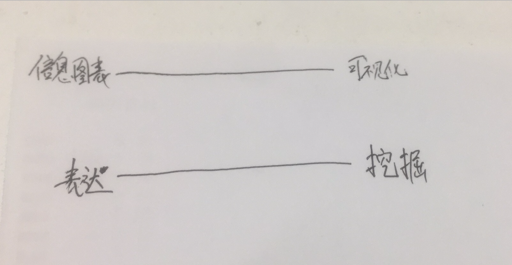
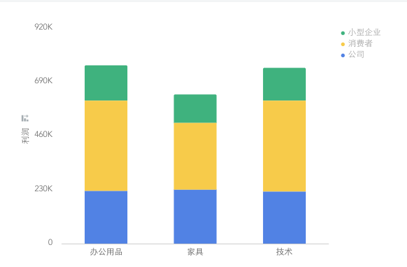
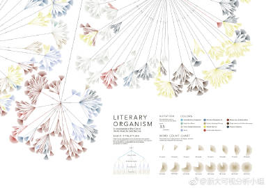
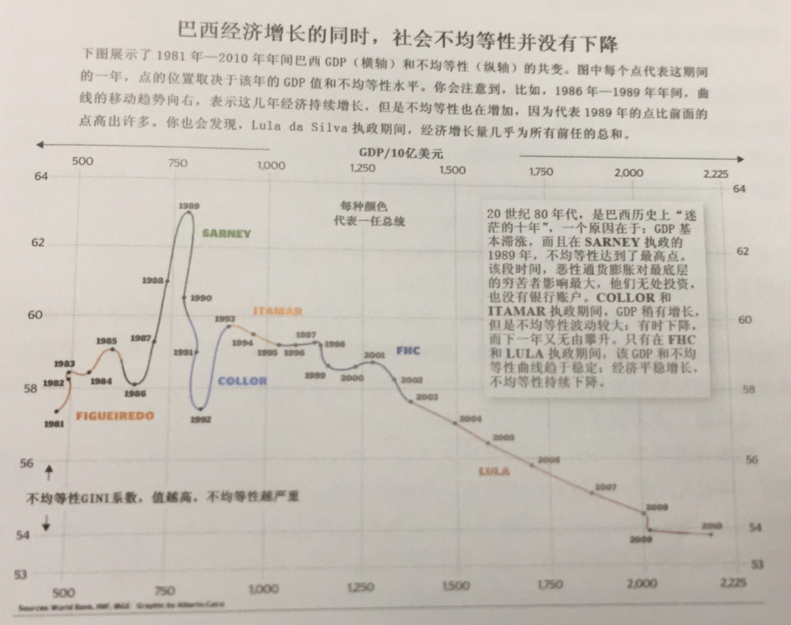

# 读书笔记：可视化是一种艺术 -《不只是美：信息图表设计原理与经典案例》序章 

## 表达与挖掘的相互关系

在看到这个主题时，相信大多数的同学会和我第一次看到一样觉得数据表达与挖掘之间貌似没有什么关系，可是当我读完这部分之后发现并不是这样的。

在一开始，作者就提出，我们的大脑是有创建并理解不同程度抽取的可视化表达的能力，而这些可视化表达式对数据、概念、关系以及地理位置编码后的图表。这句话读起来可能会有点绕，简单的来说这里作者就提出我们的大脑会对这些可视化图表进行不同程度的抽取，也就是说信息挖掘，这里就隐隐的点出了表达与挖掘之间的关系。

后面作者解释道，<strong>大脑不仅仅处理眼睛所获得的信息，也产生心里视觉图像，通过这些图像我们进行推断并采取正确的行动。</strong>这也是说明了我们在看图表所表达的事情的时候其实我们的大脑已经默认的帮我们进行了一些挖掘工作，当然这仅仅只是说在查看简单图表的时候。比如一个柱状图，折线图，我们可以轻易地看出其突出点，但是如果我们看的是一个复杂的图表，我们就需要动脑去思考图表表达的是什么意思，这就是挖掘。

## 信息图表与可视化的统一共存

接下来作者提出，<strong>信息图表与可视化的统一共存</strong>这一观点。想象两根平行线，上面这根线左边标注“信息图表”，右边标注“可视化”，下面那根左边标注“表达”，右边标注“挖掘”。如图1，所有的图表都代表数据并允许一定程度的挖掘。一些图表几乎全是表达，所以只能够对其进行有限的挖掘，如图2，我们认为他们偏向与信息图表，而其他的则更多与让读者自己分析展示的内容，在我们的直线上他们偏向于可视化，如图3，在读者花费一定时间分析后，能够找出其模式并发现不同的信息。所有的信息图表和可视化都有表达和挖掘的成分：表达信息，同时也利于读者从不同角度分析内容。这也就诠释了表达与挖掘之间的关系，还有很多的例子，大家可以去找来进行相应的分析试试。

  
  图1 - 表达与挖掘关系

  
  图2 - 简单柱状图

  
  图3 - Stefanie Posavec 的“文学有机体”

## 美感源于优雅的实用性

作者在阐明了信息图表与可视化的统一共存之后立马指出了，<strong>图表、图解和地图不仅仅是用于欣赏的工具，更是用于解读和详细分析的工具。</strong>这句话的意思就是，信息图表首要目的不是满足眼睛的感官，而是<strong>可读性</strong>，但是很多人在实际操作中却往往会忽视这一个重要的规则，要么就是将大量数据如乱麻一般展示，或者就是展示错误数据，数据之间并不能反映出一些客观事实。

作者在这里使用了一个他自己制作的一张图，来向我们展示了一些复杂的事情。如图4，这张图上的彩色折线如同历史标记一般，因为他揭示了两种变量之间的关系。这里补充一下背景知识：Lula执政期间，采取吉祥收入分配政策后，经济取得了持续稳定的增长；Jose Sarney和Fernando Collor执政期间，经济增长缓慢，不均等性无规律上下波动；Fernndo Henrique Cardoso上台后，才去一系列慰问措施，使得巴西走出了通货膨胀的黑洞。

在这个例子中，作者仅仅使用了一条简单的折线图以及折线图上面的颜色进行划分，就向我们展示了巨大的信息量，从历史出发，到每一任领导人的执政方针，以及年代国情，这张图上面展示的东西太多太多，为了能够跟上作者的思想，我还专门去查了这些领导人以及当时巴西的国情，我想这就是我对这张图的一个挖掘过程吧。

  
  图4 - 巴西经济增长与社会不均等性关系

## 序章结语

在读完序章之后，突然发现原来可视化是一个丰富的但是也是复杂的一个学问，一门艺术。在平时工作时注意到的点以及没有注意到的点，都被作者一一抓住并且做了解释。可视化不仅仅只是展示数据那么简单，首先需要进行数据的表达，根据实际需要，剖析数据，找出关联数据，将其按照一定的方式进行展示，接下来是对展示的数据进行挖掘，对于表达与挖掘的关系，我们也是需要深入的理解，多维的表达相应的能够挖掘到隐藏更深的问题或者发现，我们在挖掘数据时，可以进行多维数据比较展示，这样反应的事实也许更接近于现实。